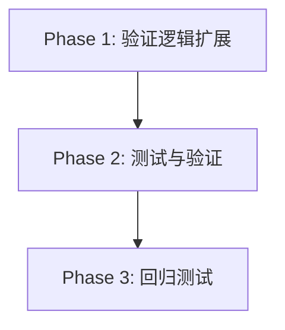

# Tasks: 自选股K线数据下载功能支持基金

**Feature**: add-kline-download-for-funds  
**Branch**: `add-kline-download-for-funds`  
**Date**: 2026-05-28  
**Spec**: [specs/kline-download/spec.md](./specs/kline-download/spec.md)  
**Design**: [design.md](./design.md)

## Dependencies & Completion Order

**Implementation Strategy**:
- **MVP Scope**: Phase 1（修改验证逻辑）+ Phase 2（手动测试基金下载）
- **Incremental Delivery**: 
  1. 修改验证函数，允许基金代码通过
  2. 测试典型基金（510050、159915、161725）的下载功能
  3. 回归测试确保A股下载不受影响

---

## Phase 1: 验证逻辑扩展

**Goal**: 修改 `klineDownloadService.ts`，扩展证券类型验证逻辑以支持基金

- [x] 1.1 在 `electron/services/klineDownloadService.ts` 中创建新的 `isValidSecurityCode()` 函数，同时支持A股和基金代码验证（A股：`/^[036]\d{5}$/`，基金：`/^(51|15|16|50|52|511)\d{4}$/`）
- [x] 1.2 修改 `validateDownloadInput()` 函数，将 `isAStockCode()` 调用替换为 `isValidSecurityCode()`
- [x] 1.3 更新错误提示信息，从"仅支持A股"改为"仅支持A股和基金"
- [x] 1.4 删除或标记废弃原有的 `isAStockCode()` 函数（保留注释说明已被 `isValidSecurityCode()` 替代）
- [x] 1.5 添加日志记录，在下载开始时输出证券类型（股票/基金）以便调试

**Checkpoint**: 验证逻辑已扩展，编译无错误

---

## Phase 2: 测试与验证

**Goal**: 验证基金K线数据下载功能正常工作

- [x] 2.1 在自选股中添加一只上交所ETF基金（如510050上证50ETF）
- [x] 2.2 手动下载该基金的K线数据（选择日期范围，勾选不复权和前复权），验证下载成功
- [x] 2.3 检查数据库中是否正确保存了该基金的不复权和前复权数据（查询 `kline_data` 表，确认 `stock_code='510050'` 的记录存在且 `adjust_type` 分别为 '' 和 'qfq'）
- [x] 2.4 在自选股中添加一只深交所ETF基金（如159915创业板ETF），重复步骤2.2-2.3
- [x] 2.5 在自选股中添加一只深交所LOF基金（如161725招商中证白酒指数LOF），重复步骤2.2-2.3
- [x] 2.6 点击基金名称弹出K线弹窗，验证K线图正确显示（包括不复权和前复权切换）
- [x] 2.7 验证基金价格显示精度为3位小数（在自选股列表和K线弹窗中）

**Checkpoint**: 基金下载功能测试通过

---

## Phase 3: 回归测试

**Goal**: 确保现有A股股票下载功能不受影响

- [x] 3.1 在自选股中添加一只沪市主板股票（如600519贵州茅台），手动下载K线数据，验证功能正常
- [x] 3.2 在自选股中添加一只深市主板股票（如000001平安银行），手动下载K线数据，验证功能正常
- [x] 3.3 在自选股中添加一只创业板股票（如300750宁德时代），手动下载K线数据，验证功能正常
- [x] 3.4 验证A股股票的价格显示精度仍为2位小数
- [x] 3.5 验证自动下载功能（模拟或等待交易日15:10），确认包含股票的自选股列表能正常执行自动下载
- [x] 3.6 在自选股中同时添加股票和基金，验证自动下载时两者都能正确处理

**Checkpoint**: 回归测试通过，A股功能未受影响

---

## Phase 4: 边界情况测试

**Goal**: 验证异常情况和边界条件

- [x] 4.1 尝试下载不支持的证券类型（如港股00700、美股AAPL），验证系统返回明确的错误提示"INVALID_STOCK_CODE: 不支持的证券类型，仅支持A股和基金"
- [x] 4.2 尝试下载非6位数字代码（如1234、1234567、abc123），验证系统拒绝并返回错误
- [x] 4.3 验证 stock-sdk 是否能正确获取基金的前复权数据（特别是基金有分红除权事件的情况）
- [x] 4.4 如果 stock-sdk 返回基金数据失败，验证错误处理是否正确（记录日志，返回友好提示）

**Checkpoint**: 边界情况测试完成

---

## Implementation Notes

**Key Files to Modify**:
- `electron/services/klineDownloadService.ts`: 核心修改文件，扩展验证逻辑

**No Changes Required**:
- 数据库表结构（`kline_data` 已支持任意6位数字代码）
- 前端UI组件（已支持基金价格显示和K线展示）
- IPC 通道定义（接口契约不变）
- 自动下载逻辑（复用现有流程）

**Testing Tips**:
- 使用真实的基金代码进行测试（510050、159915、161725）
- 检查数据库中 `adjust_type` 字段是否正确区分不复权和前复权
- 验证基金价格显示是否为3位小数（对比股票的2位小数）
- 关注 stock-sdk 返回的数据格式是否与股票一致

**Success Criteria**:
- 基金代码能通过验证并成功下载K线数据
- 数据库中正确保存基金的不复权和前复权数据
- K线弹窗能正确展示基金K线图
- 现有A股股票下载功能完全不受影响
- 错误提示清晰明确
