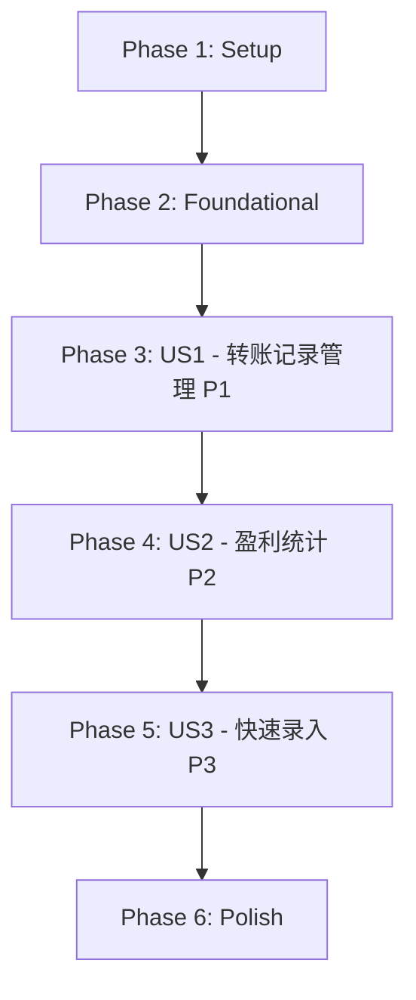

# Tasks: 资金管理功能

**Feature**: 013-fund-management  
**Branch**: `013-fund-management`  
**Date**: 2026-05-03  
**Spec**: [spec.md](./spec.md)  
**Plan**: [plan.md](./plan.md)

## Dependencies & Completion Order

**User Story Completion Order**:
1. **US1 (P1)**: 查看和管理转账记录 - 基础功能，可独立测试
2. **US2 (P2)**: 统计指定时间段内的盈利 - 依赖US1的转账数据
3. **US3 (P3)**: 快速录入常用转账 - 增强功能，可选

**Parallel Execution Opportunities**:
- Phase 2中数据库表初始化和类型定义可并行
- Phase 3中前端组件开发可并行（不同文件）
- Phase 3中Electron服务开发和Pinia store开发可并行

## Implementation Strategy

**MVP Scope**: Phase 1 + Phase 2 + Phase 3 (US1 only)
- 完整的转账记录CRUD功能
- 无限滚动列表
- 模态对话框编辑
- 可独立演示和测试

**Incremental Delivery**:
1. MVP: 转账记录管理（US1）
2. Add: 盈利统计（US2）
3. Polish: 快速录入模板（US3）+ 用户体验优化

---

## Phase 1: Setup (项目初始化)

**Goal**: 准备开发环境和基础结构

- [x] T001 扩展shared/types/index.ts添加TransferRecord和ProfitStatistics接口定义
- [x] T002 [P] 在electron/database.ts中添加initializeTransferRecordsTable函数创建转账记录表
- [x] T003 [P] 在electron/services/目录创建fundService.ts文件框架

---

## Phase 2: Foundational (基础架构)

**Goal**: 实现阻塞所有用户故事的基础设施

### Database Layer

- [x] T004 在electron/database.ts的initializeDatabase函数中调用initializeTransferRecordsTable
- [x] T005 在electron/services/fundService.ts中实现getTransferRecords方法（分页查询）
- [x] T006 [P] 在electron/services/fundService.ts中实现addTransferRecord方法（插入记录）
- [x] T007 [P] 在electron/services/fundService.ts中实现updateTransferRecord方法（更新记录）
- [x] T008 [P] 在electron/services/fundService.ts中实现deleteTransferRecord方法（删除记录）
- [x] T009 [P] 在electron/services/fundService.ts中实现getTransferStatsInRange方法（统计转入转出总额）

### IPC Handlers

- [x] T010 在electron/index.ts中注册'get-transfer-records' IPC handler调用fundService
- [x] T011 [P] 在electron/index.ts中注册'add-transfer-record' IPC handler
- [x] T012 [P] 在electron/index.ts中注册'update-transfer-record' IPC handler
- [x] T013 [P] 在electron/index.ts中注册'delete-transfer-record' IPC handler
- [x] T014 [P] 在electron/index.ts中注册'get-profit-statistics' IPC handler

### Preload API

- [x] T015 在preload/index.ts的contextBridge中暴露资金管理相关API（5个方法）

### Pinia Store

- [x] T016 创建src/stores/fundManagement.ts实现fundManagement store（state + actions框架）

---

## Phase 3: User Story 1 - 查看和管理转账记录 (Priority: P1)

**Goal**: 用户可以查看、新增、编辑、删除转账记录，支持无限滚动加载

**Independent Test**: 可以通过添加几条转账记录并验证它们正确显示在列表中，然后测试编辑和删除功能来独立验证此功能。

**Acceptance Criteria**:
1. 页面加载时显示所有历史记录（按日期倒序）
2. 点击"新增转账"按钮可添加新记录
3. 点击编辑按钮可修改记录
4. 点击删除按钮可删除记录（需确认）
5. 滚动到底部自动加载更多（每批20条）

### Composable & Utilities

- [x] T017 [US1] [P] 创建src/composables/useInfiniteScroll.ts实现无限滚动逻辑（Intersection Observer）
- [x] T018 [US1] [P] 在src/stores/fundManagement.ts中实现fetchTransferRecords action（调用IPC，支持分页和重置）

### Components

- [x] T019 [US1] [P] 创建src/components/Modal.vue基础模态对话框组件（使用Teleport）
- [x] T020 [US1] [P] 创建src/components/TransferRecordItem.vue单项组件（显示日期、金额、类型）
- [x] T021 [US1] 创建src/components/TransferRecordList.vue列表组件（集成无限滚动，调用store）
- [x] T022 [US1] 创建src/components/TransferEditor.vue编辑对话框组件（新增/编辑表单，包含验证）

### View & Integration

- [x] T023 [US1] 创建src/views/FundManagementView.vue主页面（包含el-tabs和两个标签页框架）
- [x] T024 [US1] 在FundManagementView.vue的转账记录标签页中集成TransferRecordList组件
- [x] T025 [US1] 在src/stores/fundManagement.ts中实现addTransferRecord action（调用IPC，刷新列表）
- [x] T026 [US1] 在src/stores/fundManagement.ts中实现updateTransferRecord action
- [x] T027 [US1] 在src/stores/fundManagement.ts中实现deleteTransferRecord action

### Navigation Integration

- [x] T028 [US1] 在src/components/SideNav.vue中添加“资金管理”菜单项
- [x] T029 [US1] 在src/composables/useNavigation.ts中添加资金管理路由配置

### Error Handling & Validation

- [x] T030 [US1] 在TransferEditor.vue中实现金额正数验证（FR-009）
- [x] T031 [US1] 在TransferEditor.vue中实现日期格式验证（YYYY-MM-DD）
- [x] T032 [US1] 在所有IPC调用中添加错误处理和用户提示（try-catch）

---

## Phase 4: User Story 2 - 统计指定时间段内的盈利 (Priority: P2)

**Goal**: 用户可以选择时间段查看盈利统计，实时计算转出-转入+持仓

**Independent Test**: 在已有转账记录和持仓数据的情况下，选择不同时间段验证盈利计算结果的准确性。

**Acceptance Criteria**:
1. 首次进入页面时自动显示历史所有转账记录的盈利统计
2. 用户可以选择日期范围查看特定时间段的盈利
3. 修改日期范围实时更新结果
4. 无转账记录时显示盈利=当前持仓

### Holdings Integration

- [x] T033 [US2] [P] 调研现有持仓系统获取总市值的方式（检查position store或services）
- [x] T034 [US2] [P] 在electron/index.ts中实现'get-current-holdings-total' IPC handler（调用持仓服务）
- [x] T035 [US2] 在preload/index.ts中暴露getCurrentHoldingsTotal API

### Components

- [x] T036 [US2] [P] 创建src/components/DateRangePicker.vue日期范围选择器组件（两个date input，验证开始<=结束）
- [x] T037 [US2] 创建src/components/ProfitStatistics.vue盈利统计组件（显示4个数值卡片）

### Store & Logic

- [x] T038 [US2] 在src/stores/fundManagement.ts中实现calculateProfit action（支持可选的日期范围参数，无参数时统计所有历史）
- [x] T039 [US2] 在ProfitStatistics.vue组件mounted时自动调用calculateProfit()加载历史统计
- [x] T040 [US2] 在ProfitStatistics.vue中集成DateRangePicker和结果显示
- [x] T041 [US2] 在FundManagementView.vue的盈利统计标签页中集成ProfitStatistics组件

### Edge Cases

- [x] T042 [US2] 实现持仓数据查询失败的错误提示（FR-011a）
- [x] T043 [US2] 实现无持仓数据时的“无持仓数据”提示
- [x] T044 [US2] 实现无转账记录时的盈利显示（profit = currentHoldings）

---

## Phase 5: User Story 3 - 快速录入常用转账 (Priority: P3)

**Goal**: 提供预设转账模板，减少手动输入工作量

**Independent Test**: 验证快捷转账模板是否正确填充表单字段，用户可以在此基础上进行修改并提交。

**Acceptance Criteria**:
1. 选择预设模板后表单自动填充类型和建议金额
2. 用户可以修改填充的字段后保存

### Template System

- [ ] T045 [US3] [P] 定义转账模板数据结构（在shared/types或composable中）
- [ ] T046 [US3] [P] 创建常用模板常量（初始投资、追加投资、收益提取等）
- [ ] T047 [US3] 在TransferEditor.vue中添加模板选择下拉框
- [ ] T048 [US3] 实现模板选择后自动填充表单字段的逻辑
- [ ] T049 [US3] 确保用户仍可手动修改填充后的字段

---

## Phase 6: Polish & Cross-Cutting Concerns

**Goal**: 优化用户体验，完善边界情况，性能优化

### UI/UX Improvements

- [ ] T050 为TransferRecordList添加空状态提示（无记录时显示友好提示）
- [ ] T051 为ProfitStatistics添加加载状态指示器
- [ ] T052 优化模态对话框动画效果（淡入淡出）
- [ ] T053 添加操作成功提示（Toast通知，使用现有useToast composable）

### Performance Optimization

- [ ] T054 为数据库查询添加防抖处理（日期范围变化时）
- [ ] T055 优化无限滚动的Intersection Observer配置（threshold, rootMargin）
- [ ] T056 添加列表虚拟滚动优化（如果记录数>500）

### Code Quality

- [ ] T057 运行npm run typecheck修复所有TypeScript类型错误
- [ ] T058 运行npm run lint修复所有ESLint警告
- [ ] T059 代码审查：检查所有组件的props定义和emit事件
- [ ] T060 代码审查：检查所有IPC调用的错误处理完整性

### Documentation

- [ ] T061 更新README.md添加资金管理功能使用说明（可选）

---

## Task Summary

**Total Tasks**: 61 tasks

**By Phase**:
- Phase 1 (Setup): 3 tasks
- Phase 2 (Foundational): 13 tasks
- Phase 3 (US1 - 转账记录): 16 tasks
- Phase 4 (US2 - 盈利统计): 12 tasks
- Phase 5 (US3 - 快速录入): 5 tasks
- Phase 6 (Polish): 12 tasks

**By User Story**:
- US1 (P1): 16 tasks - MVP核心功能
- US2 (P2): 12 tasks - 盈利统计
- US3 (P3): 5 tasks - 增强功能

**Parallel Opportunities Identified**:
- T002, T003 (Phase 1): 数据库初始化和服务框架可并行
- T006-T009 (Phase 2): 4个CRUD方法可并行开发
- T010-T014 (Phase 2): 5个IPC handlers可并行注册
- T017-T018 (Phase 3): Composable和Store可并行
- T019-T022 (Phase 3): 4个组件可并行开发（不同文件）
- T033-T035 (Phase 4): 持仓集成任务可并行
- T036-T037 (Phase 4): 2个组件可并行
- T044-T045 (Phase 5): 模板定义可并行

**MVP Scope (Phase 1+2+3)**: 32 tasks
- Complete transfer record CRUD functionality
- Infinite scroll loading
- Modal dialog editing
- Independently testable and demonstrable

**Format Validation**: ✅ All tasks follow checklist format
- Checkbox: `- [ ]`
- Task ID: Sequential T001-T061
- [P] marker: Included for parallelizable tasks
- [Story] label: Included for US1/US2/US3 tasks
- File paths: Specified in all task descriptions
