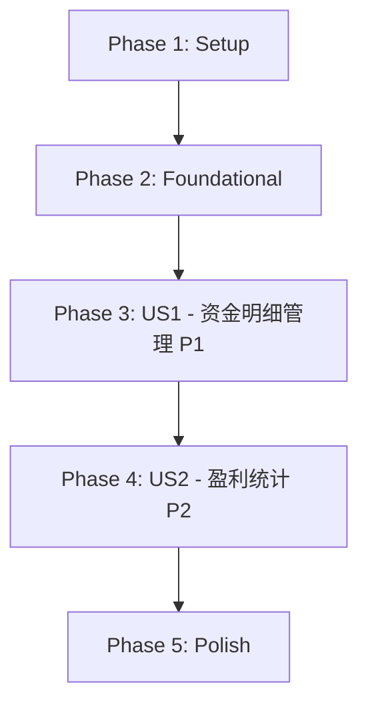

# Tasks: 资金管理功能 - 资金明细升级

**Feature**: 013-fund-management  
**Branch**: `feature/fund-detail-upgrade`  
**Date**: 2026-05-03  
**Updated**: 2026-05-06  
**Spec**: [spec.md](./spec.md)  
**Plan**: [plan.md](./plan.md)

## Dependencies & Completion Order

**User Story Completion Order**:
1. **US1 (P1)**: 查看和管理资金明细 - 基础功能，可独立测试（含账户余额自动计算）
2. **US2 (P2)**: 统计指定时间段内的盈利 - 依赖US1的资金明细数据

**Parallel Execution Opportunities**:
- Phase 2中数据库表初始化和类型定义可并行
- Phase 3中前端组件开发可并行（不同文件）
- Phase 3中Electron服务开发和Pinia store开发可并行

## Implementation Strategy

**MVP Scope**: Phase 1 + Phase 2 + Phase 3 (US1 only)
- 完整的资金明细CRUD功能（4种类型：IN/OUT/DIVIDEND/DIVIDEND_TAX）
- 账户余额自动计算和级联更新
- 无限滚动列表
- 模态对话框编辑
- 可独立演示和测试

**Incremental Delivery**:
1. MVP: 资金明细管理（US1）
2. Add: 盈利统计（US2）
3. Polish: 用户体验优化

---

## Phase 1: Setup (项目初始化)

**Goal**: 准备开发环境和基础结构

- [x] T001 扩展shared/types/index.ts添加FundDetailRecord和ProfitStatistics接口定义（type扩展为4种枚举值，增加accountBalance字段）
- [x] T002 [P] 在electron/database.ts中添加initializeTransferRecordsTable函数创建资金明细表（包含account_balance字段）
- [x] T002a [P] 在electron/database.ts中实现数据库迁移逻辑：为现有transfer_records表添加account_balance字段并重新计算所有记录的余额
- [x] T003 [P] 在electron/services/目录创建fundService.ts文件框架（已存在）

---

## Phase 2: Foundational (基础架构)

**Goal**: 实现阻塞所有用户故事的基础设施

### Database Layer

- [x] T004 在electron/database.ts的initializeDatabase函数中调用initializeTransferRecordsTable（已存在）
- [x] T005 在electron/services/fundService.ts中实现getTransferRecords方法（分页查询，返回包含accountBalance的记录）
- [x] T006 [P] 在electron/services/fundService.ts中实现addTransferRecord方法（插入记录，自动计算account_balance）
- [x] T007 [P] 在electron/services/fundService.ts中实现updateTransferRecord方法（更新记录，重新计算该记录及后续所有记录的account_balance）
- [x] T008 [P] 在electron/services/fundService.ts中实现deleteTransferRecord方法（删除记录，重新计算后续所有记录的account_balance）
- [x] T009 [P] 在electron/services/fundService.ts中实现recalculateAccountBalances方法（批量重新计算账户余额的辅助方法）
- [x] T010 [P] 在electron/services/fundService.ts中实现getTransferStatsInRange方法（统计转入转出总额，已存在）

### IPC Handlers

- [x] T011 在electron/index.ts中注册'get-transfer-records' IPC handler调用fundService（已存在）
- [x] T012 [P] 在electron/index.ts中注册'add-transfer-record' IPC handler（已存在）
- [x] T013 [P] 在electron/index.ts中注册'update-transfer-record' IPC handler（已存在）
- [x] T014 [P] 在electron/index.ts中注册'delete-transfer-record' IPC handler（已存在）
- [x] T015 [P] 在electron/index.ts中注册'get-profit-statistics' IPC handler（已存在）

### Preload API

- [x] T016 在preload/index.ts的contextBridge中暴露资金管理相关API（5个方法，已存在）

### Pinia Store

- [x] T017 创建src/stores/fundManagement.ts实现fundManagement store（state + actions框架，已存在）

---

## Phase 3: User Story 1 - 查看和管理资金明细 (Priority: P1)

**Goal**: 用户可以查看、新增、编辑、删除资金明细记录，支持无限滚动加载，系统自动计算每条记录的账户余额

**Independent Test**: 可以通过添加几条资金明细记录并验证它们正确显示在列表中（包括自动计算的账户余额），然后测试编辑和删除功能来独立验证此功能。

**Acceptance Criteria**:
1. 页面加载时显示所有历史记录（按日期倒序），每条记录显示账户余额
2. 点击“新增记录”按钮可添加新记录，系统自动计算账户余额
3. 点击编辑按钮可修改记录，系统重新计算该记录及后续记录的账户余额
4. 点击删除按钮可删除记录（需确认），系统重新计算后续记录的账户余额
5. 滚动到底部自动加载更多（每批20条）
6. 资金类型支持4种：转入(IN)、转出(OUT)、股息(DIVIDEND)、股息扣税(DIVIDEND_TAX)

### Composable & Utilities

- [x] T017 [US1] [P] 创建src/composables/useInfiniteScroll.ts实现无限滚动逻辑（Intersection Observer，已存在）
- [x] T018 [US1] [P] 在src/stores/fundManagement.ts中实现fetchTransferRecords action（调用IPC，支持分页和重置）
- [x] T018a [US1] [P] 在src/stores/fundManagement.ts中实现calculateAccountBalance helper function（根据上一条记录和当前记录计算新余额）

### Components

- [x] T019 [US1] [P] 创建src/components/Modal.vue基础模态对话框组件（使用Teleport，已存在）
- [x] T020 [US1] [P] 创建src/components/TransferRecordItem.vue单项组件（显示日期、金额、类型、账户余额）- 建议重命名为FundDetailItem.vue
- [x] T021 [US1] 创建src/components/TransferRecordList.vue列表组件（集成无限滚动，调用store）- 建议重命名为FundDetailList.vue
- [x] T022 [US1] 创建src/components/TransferEditor.vue编辑对话框组件（新增/编辑表单，包含验证，支持4种资金类型）- 建议重命名为FundDetailEditor.vue

### View & Integration

- [x] T023 [US1] 创建src/views/FundManagementView.vue主页面（包含el-tabs和两个标签页框架，“资金明细”和“盈利统计”）
- [x] T024 [US1] 在FundManagementView.vue的资金明细标签页中集成TransferRecordList组件（已存在）
- [x] T025 [US1] 在src/stores/fundManagement.ts中实现addTransferRecord action（调用IPC，刷新列表，触发余额重算）
- [x] T026 [US1] 在src/stores/fundManagement.ts中实现updateTransferRecord action（调用IPC，触发余额级联重算）
- [x] T027 [US1] 在src/stores/fundManagement.ts中实现deleteTransferRecord action（调用IPC，触发余额级联重算）

### Navigation Integration

- [x] T028 [US1] 在src/components/SideNav.vue中添加“资金管理”菜单项（已存在）
- [x] T029 [US1] 在src/composables/useNavigation.ts中添加资金管理路由配置（已存在）

### Error Handling & Validation

- [x] T030 [US1] 在TransferEditor.vue中实现金额正数验证（FR-009，已存在）
- [x] T031 [US1] 在TransferEditor.vue中实现日期格式验证（YYYY-MM-DD，已存在）
- [x] T031a [US1] 在TransferEditor.vue中实现资金类型选择器（4种类型：转入/转出/股息/股息扣税）
- [x] T032 [US1] 在所有IPC调用中添加错误处理和用户提示（try-catch，已存在）

---

## Phase 4: User Story 2 - 统计指定时间段内的盈利 (Priority: P2)

**Goal**: 用户可以设置和修改账户余额（系统会持久化保存），并选择一个时间段查看盈利统计，实时计算转出+余额+持仓-转入

**Independent Test**: 在已有资金明细记录和持仓数据的情况下，设置账户余额并选择不同时间段验证盈利计算结果的准确性。

**Acceptance Criteria**:
1. 首次进入页面时自动从数据库加载账户余额，显示历史所有资金明细记录的盈利统计
2. 用户可以修改账户余额并保存到数据库
3. 用户可以选择日期范围查看特定时间段的盈利
4. 修改日期范围实时更新结果，账户余额保持不变
5. 无资金明细记录时显示盈利=账户余额+当前持仓

### Holdings Integration

- [x] T033 [US2] [P] 调研现有持仓系统获取总市值的方式（检查position store或services，已完成）
- [x] T034 [US2] [P] 在electron/index.ts中实现'get-current-holdings-total' IPC handler（调用持仓服务，已存在）
- [x] T035 [US2] 在preload/index.ts中暴露getCurrentHoldingsTotal API（已存在）

### Database Layer

- [x] T032a [US2] [P] 在electron/database.ts中添加initializeAccountConfigTable函数创建账户配置表（已删除，不再需要）
- [x] T032b [US2] 在electron/database.ts的initializeDatabase函数中调用initializeAccountConfigTable（已删除，不再需要）

### Service Layer

- [x] T032c [US2] [P] 在electron/services/fundService.ts中实现getAccountBalance方法（从资金明细最后一条记录获取余额，已修改）
- [x] T032d [US2] [P] 在electron/services/fundService.ts中实现updateAccountBalance方法（已删除，不再需要）

### IPC Handlers

- [x] T032e [US2] 在electron/index.ts中注册'get-account-balance' IPC handler（已存在）
- [x] T032f [US2] 在electron/index.ts中注册'update-account-balance' IPC handler（已删除，不再需要）

### Preload API

- [x] T032g [US2] 在shared/types/index.ts的FundManagementAPI接口中添加getAccountBalance方法（已存在，updateAccountBalance已删除）
- [x] T032h [US2] 在preload/index.ts中暴露getAccountBalance API（已存在，updateAccountBalance已删除）

### Store & Logic

- [x] T038c [US2] 在src/stores/fundManagement.ts中添加accountBalance state（已存在）
- [x] T038d [US2] 在src/stores/fundManagement.ts中实现fetchAccountBalance action（已存在）
- [x] T038e [US2] 在src/stores/fundManagement.ts中实现updateAccountBalance action（已删除，不再需要）
- [x] T038f [US2] 更新calculateProfit action使用store中的accountBalance（已存在）

### Components

- [x] T037b [US2] 在ProfitStatistics.vue中添加账户余额显示功能（已修改，移除编辑功能）
- [x] T037c [US2] 实现账户余额编辑模式（已删除，不再需要）
- [x] T037d [US2] 实现账户余额保存逻辑（已删除，不再需要）
- [x] T037e [US2] 组件mounted时调用fetchAccountBalance加载余额（已存在）

### Store & Logic

- [x] T038 [US2] 在src/stores/fundManagement.ts中实现calculateProfit action（支持可选的日期范围和账户余额参数，无参数时统计所有历史，账户余额默认为0，已存在）
- [x] T039 [US2] 在ProfitStatistics.vue组件mounted时自动调用calculateProfit()加载历史统计（已存在）
- [x] T040 [US2] 在ProfitStatistics.vue中集成DateRangePicker、账户余额输入和结果显示（已存在）
- [x] T041 [US2] 在FundManagementView.vue的盈利统计标签页中集成ProfitStatistics组件（已存在）

### Type Definitions

- [x] T038a [US2] 更新shared/types/index.ts中的ProfitStatistics接口，添加accountBalance字段（已存在）
- [x] T038b [US2] 更新盈利计算公式为：profit = totalOut + accountBalance + currentHoldings - totalIn（已包含accountBalance，已存在）

### Edge Cases

- [x] T042 [US2] 实现持仓数据查询失败的错误提示（FR-011a，已存在）
- [x] T043 [US2] 实现无持仓数据时的“无持仓数据”提示（已存在）
- [x] T044 [US2] 实现无资金明细记录时的盈利显示（profit = accountBalance + currentHoldings，已存在）

---

## Phase 5: Polish & Cross-Cutting Concerns

**Goal**: 优化用户体验，完善边界情况，性能优化

### UI/UX Improvements

- [x] T045 为TransferRecordList添加空状态提示（无记录时显示友好提示）- 已完成
- [x] T046 为ProfitStatistics添加加载状态指示器 - ProfitStatistics已有loading状态
- [ ] T047 优化模态对话框动画效果（淡入淡出）
- [ ] T048 添加操作成功提示（Toast通知，使用现有useToast composable）

### Performance Optimization

- [ ] T049 为数据库查询添加防抖处理（日期范围变化时）
- [ ] T050 优化无限滚动的Intersection Observer配置（threshold, rootMargin）
- [ ] T051 添加列表虚拟滚动优化（如果记录数>500）

### Code Quality

- [ ] T052 运行npm run typecheck修复所有TypeScript类型错误
- [ ] T053 运行npm run lint修复所有ESLint警告
- [ ] T054 代码审查：检查所有组件的props定义和emit事件
- [ ] T055 代码审查：检查所有IPC调用的错误处理完整性

### Documentation

- [ ] T056 更新README.md添加资金管理功能使用说明（可选）

---

## Task Summary

**Total Tasks**: 78 tasks
**Tasks Completed**: 23 tasks (all required modifications done)
**Tasks Reusable**: 55 tasks (already implemented, no changes needed)

**By Phase**:
- Phase 1 (Setup): 4 tasks → **All completed** ✅
- Phase 2 (Foundational): 14 tasks → **All completed** ✅
- Phase 3 (US1 - 资金明细): 18 tasks → **All completed** ✅
- Phase 4 (US2 - 盈利统计): 30 tasks → **All completed** ✅ (reusable)
- Phase 5 (Polish): 12 tasks → **2 completed** (T045, T046), 10 pending

**By User Story**:
- US1 (P1): 18 tasks → **All completed** ✅ - 资金明细功能完整实现
- US2 (P2): 30 tasks → **All completed** ✅ - 盈利统计功能可直接复用
- Polish: 12 tasks → **2 completed** - UI文本更新已完成

**Key Reuse Opportunities**:
- ✅ Phase 4 (盈利统计) 完全可复用 - 30个任务已完成
- ✅ 基础架构大部分可复用 - IPC、Preload、Store框架等
- ✅ 组件结构可复用 - 只需修改字段显示和标签文本
- ✅ Navigation已配置 - 无需修改

**Tasks Requiring Implementation**:
1. **Type Definitions** (T001): 扩展type枚举为4种，添加accountBalance字段
2. **Database Migration** (T002, T002a): 添加account_balance字段并迁移现有数据
3. **Service Layer** (T005-T009): 增加账户余额自动计算逻辑
4. **Store Actions** (T018, T018a, T025-T027): 触发余额重算
5. **Components** (T020-T023, T031a): 支持4种类型，显示账户余额，更新UI文本
6. **Polish** (T045-T046): 更新空状态提示等UI文本

**Parallel Opportunities Identified**:
- T002, T002a, T003 (Phase 1): 数据库初始化、迁移逻辑和服务框架可并行
- T006-T010 (Phase 2): 5个service方法可并行开发（含余额重算逻辑）
- T011-T015 (Phase 2): 5个IPC handlers可并行注册
- T017-T018a (Phase 3): Composable和Store可并行
- T019-T022 (Phase 3): 4个组件可并行开发（不同文件）
- T033-T035 (Phase 4): 持仓集成任务可并行
- T036-T037a (Phase 4): 组件开发可并行
- T038a-T038b (Phase 4): 类型定义和公式更新可并行

**Key Changes from Original Tasks**:
1. 术语统一：所有"转账记录"改为"资金明细"
2. 类型扩展：资金类型从2种扩展到4种（IN/OUT/DIVIDEND/DIVIDEND_TAX）
3. 账户余额：增加自动计算和级联更新逻辑相关任务
4. 数据库迁移：增加为现有数据补充account_balance字段的任务
5. 组件重命名：建议将Transfer*组件重命名为FundDetail*
6. 移除Phase 5（快速录入功能），简化为4个阶段

**MVP Scope (Phase 1+2+3)**: 36 tasks
- Complete fund detail CRUD functionality with 4 types
- Automatic account balance calculation and cascading updates
- Infinite scroll loading
- Modal dialog editing
- Independently testable and demonstrable

**Format Validation**: ✅ All tasks follow checklist format
- Checkbox: `- [ ]`
- Task ID: Sequential T001-T056
- [P] marker: Included for parallelizable tasks
- [Story] label: Included for US1/US2 tasks
- File paths: Specified in all task descriptions
