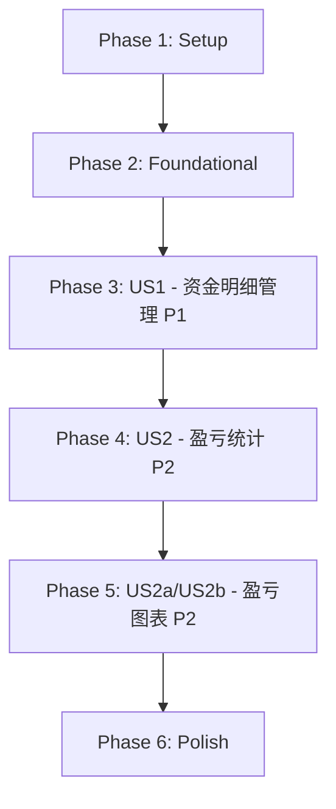

# Tasks: 资金管理功能 - 资金明细升级

**Feature**: 013-fund-management  
**Branch**: `feature/fund-detail-upgrade`  
**Date**: 2026-05-03  
**Updated**: 2026-05-08 (Session 2)  
**Spec**: [spec.md](./spec.md)  
**Plan**: [plan.md](./plan.md)

## Dependencies & Completion Order

**User Story Completion Order**:
1. **US1 (P1)**: 查看和管理资金明细 - 基础功能，可独立测试（含账户余额自动计算）
2. **US2 (P2)**: 统计指定时间段内的盈亏 - 依赖US1的资金明细数据，同时依赖kline_data和trade_record表
3. **US2a/US2b (P2)**: 年度和月度盈亏图表 - 依赖US2的数据计算方法

**Parallel Execution Opportunities**:
- Phase 2中数据库表初始化和类型定义可并行
- Phase 3中前端组件开发可并行（不同文件）
- Phase 3中Electron服务开发和Pinia store开发可并行
- Phase 4中kline_data查询、trade_record查询、transfer_records查询可并行开发

## Implementation Strategy

**MVP Scope**: Phase 1 + Phase 2 + Phase 3 (US1 only)
- 完整的资金明细CRUD功能（7种类型：IN/OUT/DIVIDEND/DIVIDEND_TAX/STOCK_BUY/STOCK_SELL/INTEREST）
- 账户余额自动计算和级联更新
- 无限滚动列表
- 模态对话框编辑
- 可独立演示和测试

**Incremental Delivery**:
1. MVP: 资金明细管理（US1）
2. Add: 盈亏统计（US2）- 含kline_data持仓市值计算和trade_record交易统计
3. Add: 年度和月度盈亏图表（US2a/US2b）- ECharts柱状图展示
4. Polish: 用户体验优化

---

## Phase 1: Setup (项目初始化)

**Goal**: 准备开发环境和基础结构

- [x] T001 扩展shared/types/index.ts添加FundDetailRecord和ProfitStatistics接口定义（type扩展为7种枚举值，增加accountBalance字段）
- [x] T002 [P] 在electron/database.ts中添加initializeTransferRecordsTable函数创建资金明细表（包含account_balance字段）
- [x] T002a [P] 在electron/database.ts中实现数据库迁移逻辑：为现有transfer_records表添加account_balance字段并重新计算所有记录的余额
- [x] T003 [P] 在electron/services/目录创建fundService.ts文件框架（已存在）

---

## Phase 2: Foundational (基础架构)

**Goal**: 实现阻塞所有用户故事的基础设施

### Database Layer

- [x] T004 在electron/database.ts的initializeDatabase函数中调用initializeTransferRecordsTable（已存在）
- [x] T005 在electron/services/fundService.ts中实现getTransferRecords方法（分页查询，返回包含accountBalance的记录）
- [x] T006 [P] 在electron/services/fundService.ts中实现addTransferRecord方法（插入记录，自动计算account_balance）
- [x] T007 [P] 在electron/services/fundService.ts中实现updateTransferRecord方法（更新记录，重新计算该记录及后续所有记录的account_balance）
- [x] T008 [P] 在electron/services/fundService.ts中实现deleteTransferRecord方法（删除记录，重新计算后续所有记录的account_balance）
- [x] T009 [P] 在electron/services/fundService.ts中实现recalculateAccountBalances方法（批量重新计算账户余额的辅助方法）
- [x] T010 [P] 在electron/services/fundService.ts中实现getTransferStatsInRange方法（统计转入转出总额，已存在）

### IPC Handlers

- [x] T011 在electron/index.ts中注册'get-transfer-records' IPC handler调用fundService（已存在）
- [x] T012 [P] 在electron/index.ts中注册'add-transfer-record' IPC handler（已存在）
- [x] T013 [P] 在electron/index.ts中注册'update-transfer-record' IPC handler（已存在）
- [x] T014 [P] 在electron/index.ts中注册'delete-transfer-record' IPC handler（已存在）
- [x] T015 [P] 在electron/index.ts中注册'get-profit-statistics' IPC handler（已存在，需修改）

### Preload API

- [x] T016 在preload/index.ts的contextBridge中暴露资金管理相关API（5个方法，已存在）

### Pinia Store

- [x] T017 创建src/stores/fundManagement.ts实现fundManagement store（state + actions框架，已存在）

---

## Phase 3: User Story 1 - 查看和管理资金明细 (Priority: P1)

**Goal**: 用户可以查看、新增、编辑、删除资金明细记录，支持无限滚动加载，系统自动计算每条记录的账户余额

**Independent Test**: 可以通过添加几条资金明细记录并验证它们正确显示在列表中（包括自动计算的账户余额），然后测试编辑和删除功能来独立验证此功能。

**Acceptance Criteria**:
1. 页面加载时显示所有历史记录（按日期倒序），每条记录显示账户余额
2. 点击"新增记录"按钮可添加新记录，系统自动计算账户余额
3. 点击编辑按钮可修改记录，系统重新计算该记录及后续记录的账户余额
4. 点击删除按钮可删除记录（需确认），系统重新计算后续记录的账户余额
5. 滚动到底部自动加载更多（每批20条）
6. 资金类型支持7种：转入(IN)、转出(OUT)、股息(DIVIDEND)、股息扣税(DIVIDEND_TAX)、股票买入(STOCK_BUY)、股票卖出(STOCK_SELL)、利息(INTEREST)

### Composable & Utilities

- [x] T017 [US1] [P] 创建src/composables/useInfiniteScroll.ts实现无限滚动逻辑（Intersection Observer，已存在）
- [x] T018 [US1] [P] 在src/stores/fundManagement.ts中实现fetchTransferRecords action（调用IPC，支持分页和重置）
- [x] T018a [US1] [P] 在src/stores/fundManagement.ts中实现calculateAccountBalance helper function（根据上一条记录和当前记录计算新余额）

### Components

- [x] T019 [US1] [P] 创建src/components/Modal.vue基础模态对话框组件（使用Teleport，已存在）
- [x] T020 [US1] [P] 创建src/components/TransferRecordItem.vue单项组件（显示日期、金额、类型、账户余额）
- [x] T021 [US1] 创建src/components/TransferRecordList.vue列表组件（集成无限滚动，调用store）
- [x] T022 [US1] 创建src/components/TransferEditor.vue编辑对话框组件（新增/编辑表单，包含验证，支持7种资金类型）

### View & Integration

- [x] T023 [US1] 创建src/views/FundManagementView.vue主页面（包含el-tabs和两个标签页框架，"资金明细"和"盈亏统计"）
- [x] T024 [US1] 在FundManagementView.vue的资金明细标签页中集成TransferRecordList组件（已存在）
- [x] T025 [US1] 在src/stores/fundManagement.ts中实现addTransferRecord action（调用IPC，刷新列表，触发余额重算）
- [x] T026 [US1] 在src/stores/fundManagement.ts中实现updateTransferRecord action（调用IPC，触发余额级联重算）
- [x] T027 [US1] 在src/stores/fundManagement.ts中实现deleteTransferRecord action（调用IPC，触发余额级联重算）

### Navigation Integration

- [x] T028 [US1] 在src/components/SideNav.vue中添加"资金管理"菜单项（已存在）
- [x] T029 [US1] 在src/composables/useNavigation.ts中添加资金管理路由配置（已存在）

### Error Handling & Validation

- [x] T030 [US1] 在TransferEditor.vue中实现金额正数验证（FR-009，已存在）
- [x] T031 [US1] 在TransferEditor.vue中实现日期格式验证（YYYY-MM-DD，已存在）
- [x] T031a [US1] 在TransferEditor.vue中实现资金类型选择器（7种类型：转入/转出/股息/股息扣税/股票买入/股票卖出/利息）
- [x] T032 [US1] 在所有IPC调用中添加错误处理和用户提示（try-catch，已存在）

---

## Phase 4: User Story 2 - 统计指定时间段内的盈亏 (Priority: P2)

**Goal**: 用户可以选择一个时间段查看盈亏统计。盈亏公式为：盈亏金额=(期末账户余额+期末持仓市值)-(期初账户余额+期初持仓市值)+(转出金额-转入金额)。期末/期初账户余额来自transfer_records表，期末/期初持仓市值来自kline_data表各持股收盘价×持仓数量之和，转入/转出金额来自trade_record表。

**Independent Test**: 在已有资金明细记录、交易记录和K线数据的情况下，选择不同时间段验证盈亏计算结果的准确性。

**Acceptance Criteria**:
1. 首次进入页面时自动计算并显示历史所有记录的盈亏统计
2. 期初账户余额取transfer_records表中截止期初日期最近一条记录的account_balance，期末账户余额取截止期末日期最近一条记录的account_balance
3. 期初/期末持仓市值使用kline_data各持股收盘价×持仓数量之和计算，无K线数据时使用最近前一个交易日收盘价
4. 转入金额使用trade_record表BUY类型交易总金额（含手续费），转出金额使用SELL类型交易总金额（扣除手续费和印花税）
5. 用户可以选择日期范围查看特定时间段的盈亏
6. 修改日期范围实时更新所有盈亏数据
7. 无资金明细记录时期初/期末账户余额默认为0
8. 无K线数据时提示"无K线数据"并跳过该持股
9. 无trade_record记录时转入/转出金额为0

### Type Definitions

- [x] T057 [US2] 更新shared/types/index.ts中的ProfitStatistics接口，替换为新字段：openingAccountBalance、closingAccountBalance、openingHoldingsValue、closingHoldingsValue、totalIn（来自trade_record）、totalOut（来自trade_record）、profit
- [x] T058 [US2] 更新shared/types/index.ts中的FundManagementAPI接口，新增getHoldingsMarketValue和getTradeStatsInRange方法签名，移除getCurrentHoldingsTotal方法签名

### Service Layer - 持仓市值计算

- [x] T059 [US2] [P] 在electron/services/fundService.ts中实现getHoldingsMarketValue方法（获取指定日期的持仓市值，使用kline_data收盘价×持仓数量计算，无K线数据时使用最近前一个交易日收盘价）
- [x] T060 [US2] [P] 在electron/services/fundService.ts中实现getClosingBalance方法（获取截止指定日期最近一条记录的account_balance）

### Service Layer - 交易统计

- [x] T061 [US2] [P] 在electron/services/fundService.ts中实现getTradeStatsInRange方法（从trade_record表统计BUY类型转入总金额和SELL类型转出总金额，含手续费计算）

### Service Layer - 盈亏统计整合

- [x] T062 [US2] 在electron/services/fundService.ts中重写getProfitStatistics方法（整合期初/期末账户余额、期初/期末持仓市值、转入/转出金额，计算盈亏金额）

### IPC Handlers

- [x] T063 [US2] [P] 在electron/index.ts中注册'get-holdings-market-value' IPC handler（调用fundService.getHoldingsMarketValue）
- [x] T064 [US2] [P] 在electron/index.ts中注册'get-trade-stats-in-range' IPC handler（调用fundService.getTradeStatsInRange）
- [x] T065 [US2] 在electron/index.ts中修改'get-profit-statistics' IPC handler（调用重写后的fundService.getProfitStatistics，返回完整盈亏统计数据）
- [x] T066 [US2] 在electron/index.ts中移除'get-current-holdings-total' IPC handler（不再需要，由get-holdings-market-value替代）

### Preload API

- [x] T067 [US2] 在preload/index.ts中暴露getHoldingsMarketValue API
- [x] T068 [US2] 在preload/index.ts中暴露getTradeStatsInRange API
- [x] T069 [US2] 在preload/index.ts中移除getCurrentHoldingsTotal API

### Pinia Store

- [x] T070 [US2] 在src/stores/fundManagement.ts中添加openingAccountBalance、closingAccountBalance、openingHoldingsValue、closingHoldingsValue state字段
- [x] T071 [US2] 在src/stores/fundManagement.ts中移除accountBalance state字段（由openingAccountBalance/closingAccountBalance替代）
- [x] T072 [US2] 重写src/stores/fundManagement.ts中的calculateProfit action（调用新的getProfitStatistics IPC获取完整盈亏统计数据，不再在前端拼接计算）

### Components

- [x] T073 [US2] 重写src/components/ProfitStatistics.vue组件（标题改为"盈亏统计"，展示期初/期末账户余额、期初/期末持仓市值、转入/转出总额、盈亏金额）
- [x] T074 [US2] 在ProfitStatistics.vue中实现无K线数据时的"无K线数据"提示
- [x] T075 [US2] 在ProfitStatistics.vue中实现无trade_record记录时转入/转出金额显示为0

### Edge Cases

- [x] T076 [US2] 实现kline_data查询失败的错误提示（FR-011a，引导用户检查K线数据下载状态）
- [x] T077 [US2] 实现无资金明细记录时的盈亏显示（期初/期末账户余额为0）
- [x] T078 [US2] 实现某只持股无对应日期K线数据时使用最近前一个交易日收盘价的逻辑
- [x] T079 [US2] 实现trade_record查询失败时的错误处理（转入/转出金额默认为0并提示）

### View Integration

- [x] T080 [US2] 在FundManagementView.vue中将"盈利统计"标签页名称改为"盈亏统计"

---

## Phase 5: User Story 2a/2b - 年度和月度盈亏图表 (Priority: P2)

**Goal**: 在盈亏统计页面下方增加两个图表：左侧年度盈亏柱状图（从2024年开始），右侧月度盈亏柱状图（过去24个月包括当月）。盈利显示红色且在X轴上方，亏损显示绿色且在X轴下方。

**Independent Test**: 在有足够年份和月份的资金明细、持仓和K线数据的情况下，验证年度和月度柱状图是否正确显示盈亏金额，颜色是否符合红涨绿跌规范，柱子位置是否在正确的X轴方向。

**Acceptance Criteria**:
1. 年度图表从2024年开始显示到当前年份，每个柱子代表一年的盈亏
2. 月度图表显示过去24个月（包括当月），每个柱子代表一个月的盈亏
3. 盈利年份/月份用红色(#ef4444)表示且柱子在X轴上方（正值）
4. 亏损年份/月份用绿色(#10b981)表示且柱子在X轴下方（负值）
5. 鼠标悬停时显示详细数据提示
6. 无数据的年份/月份柱子高度为0

### Dependencies

- [ ] T081 [US2a/US2b] 创建src/composables/useProfitChart.ts composable（封装Canvas柱状图绘制逻辑，参考useKlineChart）

### Type Definitions

- [ ] T082 [US2a/US2b] 在shared/types/index.ts中添加AnnualProfitData接口定义
- [ ] T083 [US2a/US2b] 在shared/types/index.ts中添加MonthlyProfitData接口定义
- [ ] T084 [US2a/US2b] 在shared/types/index.ts的FundManagementAPI中添加getAnnualProfitData和getMonthlyProfitData方法签名

### Service Layer

- [ ] T085 [US2a/US2b] [P] 在electron/services/fundService.ts中实现getAnnualProfitData方法（获取从2024年开始到当前年份的年度盈亏数据数组）
- [ ] T086 [US2a/US2b] [P] 在electron/services/fundService.ts中实现getMonthlyProfitData方法（获取过去24个月的月度盈亏数据数组）

### IPC Handlers

- [ ] T087 [US2a/US2b] [P] 在electron/index.ts中注册'get-annual-profit-data' IPC handler
- [ ] T088 [US2a/US2b] [P] 在electron/index.ts中注册'get-monthly-profit-data' IPC handler

### Preload API

- [ ] T089 [US2a/US2b] 在preload/index.ts中暴露getAnnualProfitData API
- [ ] T090 [US2a/US2b] 在preload/index.ts中暴露getMonthlyProfitData API

### Pinia Store

- [ ] T091 [US2a/US2b] 在src/stores/fundManagement.ts中添加annualProfitData和monthlyProfitData state字段
- [ ] T092 [US2a/US2b] 在src/stores/fundManagement.ts中实现fetchAnnualProfitData action
- [ ] T093 [US2a/US2b] 在src/stores/fundManagement.ts中实现fetchMonthlyProfitData action

### Components

- [ ] T094 [US2a/US2b] 创建src/components/ProfitChart.vue组件（包含年度和月度两个柱状图）
- [ ] T095 [US2a/US2b] 在ProfitChart.vue中使用Canvas绘制年度柱状图（从2024年开始，红涨绿跌，X轴上下方显示）
- [ ] T096 [US2a/US2b] 在ProfitChart.vue中使用Canvas绘制月度柱状图（过去24个月，红涨绿跌，X轴上下方显示）
- [ ] T097 [US2a/US2b] 在ProfitChart.vue中实现鼠标悬停数据提示功能（参考KlineChartDialog的tooltip实现）
- [ ] T098 [US2a/US2b] 在ProfitChart.vue中实现响应式布局（左右两个图表并排）

### View Integration

- [ ] T099 [US2a/US2b] 在ProfitStatistics.vue中集成ProfitChart组件（放在统计卡片下方）
- [ ] T100 [US2a/US2b] 在FundManagementView.vue切换到盈亏统计标签时自动加载图表数据

### Edge Cases

- [ ] T101 [US2a/US2b] 处理某年/某月无数据的情况（柱子高度为0）
- [ ] T102 [US2a/US2b] 处理Canvas初始化失败的错误提示
- [ ] T103 [US2a/US2b] 处理窗口resize时图表自适应
- [ ] T104 [US2a/US2b] 在组件卸载时释放Canvas资源（参考KlineChartDialog的onBeforeUnmount）

---

## Phase 6: Polish & Cross-Cutting Concerns

**Goal**: 优化用户体验，完善边界情况，性能优化

### UI/UX Improvements

- [x] T045 为TransferRecordList添加空状态提示（无记录时显示友好提示）- 已完成
- [x] T046 为ProfitStatistics添加加载状态指示器 - ProfitStatistics已有loading状态
- [ ] T047 优化模态对话框动画效果（淡入淡出）
- [ ] T048 添加操作成功提示（Toast通知，使用现有useToast composable）

### Performance Optimization

- [ ] T049 为数据库查询添加防抖处理（日期范围变化时）
- [ ] T050 优化无限滚动的Intersection Observer配置（threshold, rootMargin）
- [ ] T051 添加列表虚拟滚动优化（如果记录数>500）

### Code Quality

- [ ] T052 运行npm run typecheck修复所有TypeScript类型错误
- [ ] T053 运行npm run lint修复所有ESLint警告
- [ ] T054 代码审查：检查所有组件的props定义和emit事件
- [ ] T055 代码审查：检查所有IPC调用的错误处理完整性

### Documentation

- [ ] T056 更新README.md添加资金管理功能使用说明（可选）

---

## Task Summary

**Total Tasks**: 103 tasks
**Tasks Completed**: 64 tasks (Phase 1-4 全部完成)
**Tasks Pending**: 39 tasks (Phase 5 + Phase 6)

**By Phase**:
- Phase 1 (Setup): 4 tasks → **All completed** ✅
- Phase 2 (Foundational): 14 tasks → **All completed** ✅
- Phase 3 (US1 - 资金明细): 18 tasks → **All completed** ✅
- Phase 4 (US2 - 盈亏统计): 24 tasks → **All completed** ✅
- Phase 5 (US2a/US2b - 盈亏图表): 23 tasks → **0 completed**, 23 pending
- Phase 6 (Polish): 12 tasks → **2 completed** (T045, T046), 10 pending

**By User Story**:
- US1 (P1): 18 tasks → **All completed** ✅ - 资金明细功能完整实现
- US2 (P2): 24 tasks → **All completed** ✅ - 盈亏统计按新公式重写完成
- US2a/US2b (P2): 23 tasks → **0 completed** - 年度和月度图表待实现
- Polish: 12 tasks → **2 completed** - UI文本更新已完成

**Phase 4 Key Changes (2026-05-08)**:
1. **公式变更**: 从"盈利=转出+余额+持仓-转入"改为"盈亏=(期末余额+期末持仓)-(期初余额+期初持仓)+(转出-转入)"
2. **数据源变更**: 账户余额来自transfer_records表，持仓市值来自kline_data表，转入/转出来自trade_record表
3. **新增接口**: getHoldingsMarketValue（按日期获取持仓市值）、getTradeStatsInRange（按时间段获取交易统计）
4. **移除接口**: getCurrentHoldingsTotal（由getHoldingsMarketValue替代）
5. **ProfitStatistics接口重写**: 新增openingAccountBalance、closingAccountBalance、openingHoldingsValue、closingHoldingsValue字段
6. **前端计算简化**: 盈亏统计计算逻辑移至后端，前端直接使用后端返回的完整数据

**Phase 5 Key Changes (2026-05-08 Session 2)**:
1. **新增图表功能**: 年度盈亏柱状图（从2024年开始）和月度盈亏柱状图（过去24个月）
2. **Canvas集成**: 使用Canvas进行图表渲染（与K线图技术栈保持一致）
3. **可视化规范**: 盈利红色在X轴上方，亏损绿色在X轴下方
4. **新数据类型**: AnnualProfitData和MonthlyProfitData
5. **新服务方法**: getAnnualProfitData和getMonthlyProfitData
6. **新增composable**: useProfitChart.ts封装Canvas绘制逻辑

**Phase 4 Task Breakdown**:
- Type Definitions (T057-T058): 2 tasks
- Service Layer - 持仓市值 (T059-T060): 2 tasks
- Service Layer - 交易统计 (T061): 1 task
- Service Layer - 整合 (T062): 1 task
- IPC Handlers (T063-T066): 4 tasks
- Preload API (T067-T069): 3 tasks
- Pinia Store (T070-T072): 3 tasks
- Components (T073-T075): 3 tasks
- Edge Cases (T076-T079): 4 tasks
- View Integration (T080): 1 task

**Parallel Opportunities in Phase 4**:
- T057, T058 (类型定义): 可并行
- T059, T060, T061 (Service Layer): 三个独立方法可并行开发
- T063, T064 (IPC Handlers): 可并行注册
- T067, T068 (Preload API): 可并行暴露

**MVP Scope (Phase 1+2+3)**: 36 tasks
- Complete fund detail CRUD functionality with 7 types
- Automatic account balance calculation and cascading updates
- Infinite scroll loading
- Modal dialog editing
- Independently testable and demonstrable

**Format Validation**: ✅ All tasks follow checklist format
- Checkbox: `- [ ]` or `- [x]`
- Task ID: Sequential T001-T080 (plus T045-T056 in Phase 5)
- [P] marker: Included for parallelizable tasks
- [Story] label: Included for US1/US2 tasks
- File paths: Specified in all task descriptions
