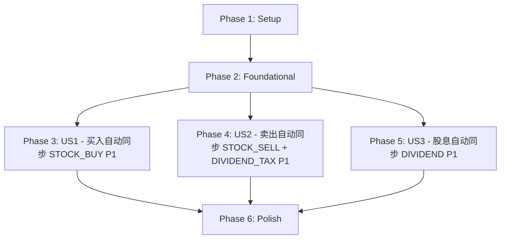

# Tasks: 交易记录新增时自动同步资金明细

**Feature**: 014-trade-fund-sync  
**Branch**: `014-trade-fund-sync`  
**Date**: 2026-05-07  
**Spec**: [spec.md](./spec.md)  
**Plan**: [plan.md](./plan.md)

## Dependencies & Completion Order



**User Story Completion Order**:
1. **US1 (P1)**: 买入股票时自动记录资金流出 - 基础同步逻辑，可独立测试
2. **US2 (P1)**: 卖出股票时自动记录资金流入和股息扣税 - 依赖FIFO算法，可独立测试
3. **US3 (P1)**: 股息分红时自动记录资金流入 - 最简单的同步，可独立测试

**Parallel Execution Opportunities**:
- Phase 1中类型定义和辅助函数可并行
- Phase 3/4/5的US1/US2/US3核心逻辑可并行开发（不同函数）
- US3逻辑最简单，可最先完成验证

## Implementation Strategy

**MVP Scope**: Phase 1 + Phase 2 + Phase 3 (US1 only)
- 买入交易自动同步STOCK_BUY到资金明细
- 返回值变更（AddTradeResult）
- Toast通知框架
- 可独立演示和测试

**Incremental Delivery**:
1. MVP: 买入自动同步（US1）
2. Add: 卖出自动同步 + FIFO股息税（US2）
3. Add: 股息自动同步（US3）
4. Polish: 用户体验优化

---

## Phase 1: Setup (共享基础设施)

**Goal**: 准备类型定义和辅助函数，为所有用户故事提供基础

- [x] T001 在shared/types/index.ts中添加AddTradeResult接口定义（包含record、fundSyncSuccess、fundSyncError字段）
- [x] T002 [P] 在electron/services/tradeService.ts中添加BuyBatch接口定义（包含remainingCount、purchaseDate字段）
- [x] T003 [P] 在electron/services/tradeService.ts中添加calcStockBuyAmount辅助函数（复用现有常量计算买入金额+手续费）
- [x] T004 [P] 在electron/services/tradeService.ts中添加calcStockSellAmount辅助函数（复用现有常量计算卖出金额-手续费-印花税）
- [x] T005 [P] 在electron/services/tradeService.ts中添加getNextDay辅助函数（计算卖出次日日期，简单+1天）

---

## Phase 2: Foundational (基础架构)

**Goal**: 修改addTradeRecord返回值和IPC通信，为所有用户故事提供同步框架

**⚠️ CRITICAL**: 所有用户故事依赖此阶段的返回值变更和IPC修改

- [x] T006 修改electron/database.ts中addTradeRecord函数返回值类型为AddTradeResult，包装现有返回值为{ record, fundSyncSuccess: true }
- [x] T007 修改electron/index.ts中position:add-record IPC handler，适配AddTradeResult返回值，添加同步逻辑框架（try-catch包裹，同步失败时设置fundSyncSuccess=false和fundSyncError）
- [x] T008 修改preload/index.ts中addRecord方法返回类型为Promise<AddTradeResult>
- [x] T009 修改shared/types/index.ts中PositionAPI的addRecord方法签名，返回类型改为Promise<AddTradeResult>
- [x] T010 修改src/components/PositionItem.vue中调用addRecord的地方，适配AddTradeResult返回值，添加fundSyncSuccess为false时的Toast通知逻辑

**Checkpoint**: 基础框架就绪 - addTradeRecord返回AddTradeResult，同步失败时Toast通知可用，用户故事实现可以开始

---

## Phase 3: User Story 1 - 买入股票时自动记录资金流出 (Priority: P1) 🎯 MVP

**Goal**: 用户新增买入交易记录时，系统自动在资金明细表中创建STOCK_BUY类型的记录

**Independent Test**: 在持仓页面新增一笔买入交易，切换到资金明细页面验证是否自动出现STOCK_BUY类型记录，金额和日期正确，账户余额正确减少

**Acceptance Criteria**:
1. 新增买入交易后，资金明细表自动创建STOCK_BUY记录
2. STOCK_BUY金额 = 买入金额 + 手续费（与calcHoldingPrice中手续费计算一致）
3. 日期与交易日期一致
4. 同步失败时交易记录仍保存成功，Toast通知提示用户

- [x] T011 [US1] 在electron/index.ts的position:add-record IPC handler中，当tradeType为BUY时，调用calcStockBuyAmount计算金额，然后调用fundService.addTransferRecord创建STOCK_BUY类型记录
- [x] T012 [US1] 验证买入同步金额计算与现有calcHoldingPrice中手续费逻辑一致（沪市佣金、深市佣金+华泰费）

**Checkpoint**: 买入交易自动同步功能完整可用，可独立测试

---

## Phase 4: User Story 2 - 卖出股票时自动记录资金流入和股息扣税 (Priority: P1)

**Goal**: 用户新增卖出交易记录时，系统自动创建STOCK_SELL记录，并根据FIFO算法计算股息税创建DIVIDEND_TAX记录

**Independent Test**: 在持仓页面新增一笔卖出交易，验证资金明细表中自动出现STOCK_SELL记录；如果持股期间有分红，验证DIVIDEND_TAX记录金额按FIFO计算正确

**Acceptance Criteria**:
1. 新增卖出交易后，资金明细表自动创建STOCK_SELL记录，金额=卖出金额-手续费-印花税
2. 如果持股期间有分红且存在需扣税批次，自动创建DIVIDEND_TAX记录，日期为卖出次日
3. FIFO逐批计算：每个批次独立计算持股天数和税率，汇总为一条记录
4. 所有批次免税时不创建DIVIDEND_TAX记录
5. 同步失败时交易记录仍保存成功

### FIFO股息税算法

- [x] T013 [US2] 在electron/services/tradeService.ts中实现calcDividendTax函数：构建FIFO买入批次队列，将卖出数量拆分到各批次，逐批计算股息税并汇总
- [x] T014 [US2] 在calcDividendTax中实现持股天数计算和税率判断逻辑：≤30天20%，31~365天10%，>365天免税，临界点按较低税率

### 卖出同步逻辑

- [x] T015 [US2] 在electron/index.ts的position:add-record IPC handler中，当tradeType为SELL时，调用calcStockSellAmount计算金额，然后调用fundService.addTransferRecord创建STOCK_SELL类型记录
- [x] T016 [US2] 在卖出同步逻辑中，调用calcDividendTax计算股息税，如果金额>0则调用fundService.addTransferRecord创建DIVIDEND_TAX类型记录（日期为卖出次日）
- [x] T017 [US2] 在electron/database.ts中添加getTradeRecordsByStockCode函数（获取指定股票所有交易记录，按日期升序，供FIFO计算使用）

**Checkpoint**: 卖出交易自动同步功能完整可用，FIFO股息税计算可独立验证

---

## Phase 5: User Story 3 - 股息分红时自动记录资金流入 (Priority: P1)

**Goal**: 用户新增股息交易记录时，系统自动在资金明细表中创建DIVIDEND类型的记录

**Independent Test**: 在持仓页面新增一笔股息交易，验证资金明细表中自动出现DIVIDEND类型记录，金额=每股股息×持股数量，账户余额正确增加

**Acceptance Criteria**:
1. 新增股息交易后，资金明细表自动创建DIVIDEND记录
2. DIVIDEND金额 = 每股股息(tradePrice) × 持股数量(holdingCount)
3. 日期与交易日期一致
4. 同步失败时交易记录仍保存成功

- [x] T018 [US3] 在electron/index.ts的position:add-record IPC handler中，当tradeType为DIVIDEND时，计算股息总额(tradePrice × holdingCount)，然后调用fundService.addTransferRecord创建DIVIDEND类型记录

**Checkpoint**: 股息交易自动同步功能完整可用，三个用户故事全部完成

---

## Phase 6: Polish & Cross-Cutting Concerns

**Purpose**: 跨用户故事的改进和验证

- [x] T019 验证三种交易类型(BUY/SELL/DIVIDEND)的自动同步在连续操作场景下正常工作（买入→股息→卖出完整流程）
- [x] T020 [P] 验证同步失败场景：fundService.addTransferRecord抛异常时，交易记录仍保存成功，Toast通知正确显示
- [x] T021 [P] 验证手动录入的STOCK_BUY/STOCK_SELL/DIVIDEND/DIVIDEND_TAX记录与自动同步记录独立共存
- [x] T022 运行TypeScript类型检查确保无类型错误

---

## Dependencies & Execution Order

### Phase Dependencies

- **Setup (Phase 1)**: 无依赖，可立即开始
- **Foundational (Phase 2)**: 依赖Phase 1完成 - 阻塞所有用户故事
- **User Stories (Phase 3/4/5)**: 均依赖Phase 2完成
  - US1和US3可并行开发（不同逻辑分支）
  - US2依赖T017(getTradeRecordsByStockCode)，建议在US1之后开发
- **Polish (Phase 6)**: 依赖所有用户故事完成

### User Story Dependencies

- **US1 (P1)**: Phase 2完成后即可开始 - 无其他故事依赖
- **US2 (P1)**: Phase 2完成后即可开始 - FIFO算法独立，但需T017获取交易记录
- **US3 (P1)**: Phase 2完成后即可开始 - 最简单，无依赖

### Within Each User Story

- 辅助函数先于同步逻辑
- 核心算法先于集成调用
- 集成调用先于验证

### Parallel Opportunities

- T001/T002/T003/T004/T005 可并行（不同文件或独立函数）
- T006/T007/T008/T009/T010 需顺序执行（同一调用链的上下游）
- T011(US1) 和 T018(US3) 可并行（不同tradeType分支）
- T019/T020/T021 可并行（不同验证场景）

---

## Parallel Example: Phase 1

```bash
# 并行执行所有Setup任务:
Task: "T001 添加AddTradeResult接口"
Task: "T002 添加BuyBatch接口"
Task: "T003 添加calcStockBuyAmount函数"
Task: "T004 添加calcStockSellAmount函数"
Task: "T005 添加getNextDay函数"
```

## Parallel Example: User Stories

```bash
# Phase 2完成后，US1和US3可并行:
Task: "T011 [US1] 买入同步逻辑"
Task: "T018 [US3] 股息同步逻辑"

# US2的FIFO算法可独立开发:
Task: "T013 [US2] calcDividendTax函数"
```

---

## Notes

- [P] 任务 = 不同文件，无依赖，可并行
- [Story] 标签将任务映射到具体用户故事，便于追溯
- 每个用户故事应可独立完成和测试
- 同步失败不阻塞交易记录保存（FR-005）
- 手续费计算复用tradeService.ts现有常量，不新建函数
- transfer_records表不新增字段，自动同步记录与手动录入记录独立共存
