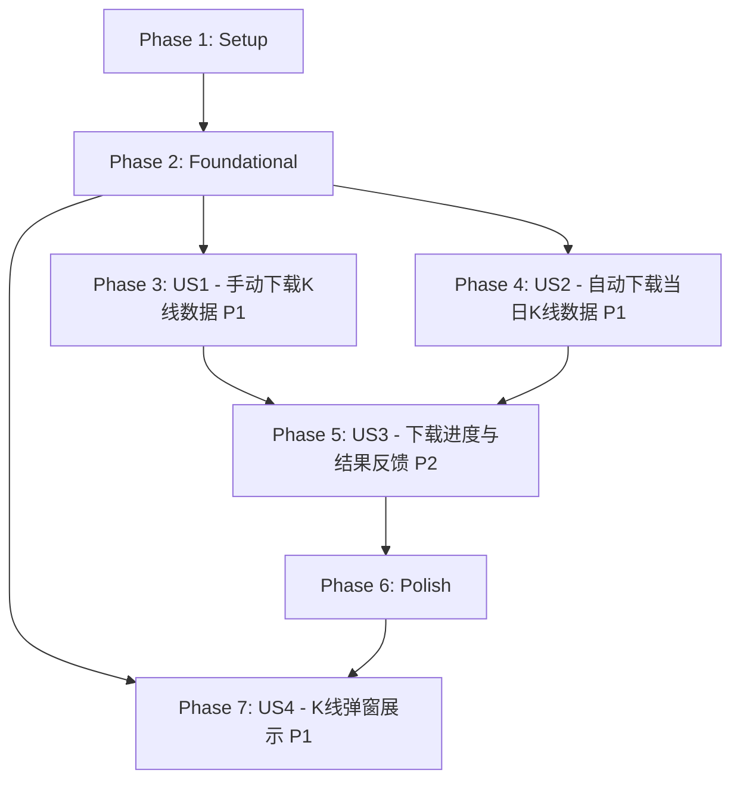

# Tasks: 自选股K线数据下载与展示功能

**Feature**: 015-kline-download  
**Branch**: `015-kline-download`  
**Date**: 2026-05-08  
**Spec**: [spec.md](./spec.md)  
**Plan**: [plan.md](./plan.md)

## Dependencies & Completion Order

**User Story Completion Order**:
1. **US1 (P1)**: 手动下载历史K线数据 - 基础下载逻辑和UI交互，可独立测试
2. **US2 (P1)**: 自动下载当日K线数据 - 依赖下载服务，可独立测试
3. **US3 (P2)**: 下载进度与结果反馈 - 增强用户体验，依赖US1/US2
4. **US4 (P1)**: K线弹窗展示 - 依赖数据库和下载服务，点击股票名称展示K线图

**Parallel Execution Opportunities**:
- Phase 1中类型定义和npm安装可并行
- Phase 2中数据库操作和服务创建可并行
- Phase 3和Phase 4的US1/US2核心逻辑可并行开发（不同文件）
- US1的UI部分和US2的调度逻辑互不依赖

## Implementation Strategy

**MVP Scope**: Phase 1 + Phase 2 + Phase 3 (US1 only)
- 安装stock-sdk，创建数据库表和下载服务
- 手动下载K线数据功能完整可用
- 可独立演示和测试

**Incremental Delivery**:
1. MVP: 手动下载K线数据（US1）
2. Add: 自动下载当日K线数据（US2）
3. Add: 下载进度与结果反馈优化（US3）
4. Add: K线弹窗展示（US4）
5. Polish: 边界情况处理和用户体验优化

---

## Phase 1: Setup (共享基础设施)

**Goal**: 安装依赖、定义类型、准备数据库表，为所有用户故事提供基础

- [x] T001 安装stock-sdk依赖：执行 `npm install stock-sdk`，验证package.json中包含stock-sdk依赖
- [x] T002 [P] 在shared/types/index.ts中添加KlineData接口定义（包含id、stockCode、tradeDate、open、close、high、low、volume、amount、amplitude、changePercent、changeAmount、turnoverRate、createdAt、updatedAt字段）
- [x] T003 [P] 在shared/types/index.ts中添加KlineDownloadResult接口定义（包含success、count?、error?字段）
- [x] T004 [P] 在shared/types/index.ts中添加KlineDownloadInput接口定义（包含stockCode、startDate、endDate字段）
- [x] T005 [P] 在shared/types/index.ts中添加KlineAPI接口定义（包含downloadKline和getKlineData方法）
- [x] T006 [P] 在shared/types/index.ts的Window接口中添加klineAPI: KlineAPI声明
- [x] T007 [P] 在src/types.ts中从shared/types重新导出KlineData、KlineDownloadResult、KlineDownloadInput、KlineAPI类型

---

## Phase 2: Foundational (基础架构)

**Goal**: 创建数据库表、下载服务核心逻辑、IPC通信，为所有用户故事提供下载框架

**⚠️ CRITICAL**: 所有用户故事依赖此阶段的数据库表和下载服务

- [x] T008 在electron/database.ts的initDatabase函数中添加kline_data表的CREATE TABLE IF NOT EXISTS语句（包含id、stock_code、trade_date、open、close、high、low、volume、amount、amplitude、change_percent、change_amount、turnover_rate、created_at、updated_at字段，UNIQUE(stock_code, trade_date)约束）
- [x] T009 [P] 在electron/database.ts的initDatabase函数中添加kline_data表的三个索引（idx_kline_data_stock_code、idx_kline_data_trade_date、idx_kline_data_stock_date）
- [x] T010 在electron/database.ts中添加saveKlineData函数（接收stockCode和HistoryKline数组，批量INSERT OR REPLACE写入kline_data表，使用事务提升性能，完成后调用saveDatabase）
- [x] T011 [P] 在electron/database.ts中添加getKlineData函数（接收stockCode、可选startDate和endDate，查询kline_data表返回KlineData数组，按trade_date升序排列）
- [x] T012 创建electron/services/klineDownloadService.ts，实现StockSDK实例化（模块级单例，配置retry: { maxRetries: 1, baseDelay: 500 }）
- [x] T013 在electron/services/klineDownloadService.ts中实现downloadKline函数（接收stockCode、startDate、endDate参数，调用sdk.getHistoryKline获取不复权日K线数据，调用saveKlineData保存到数据库，返回KlineDownloadResult）
- [x] T014 [P] 在electron/services/klineDownloadService.ts中实现validateDownloadInput函数（验证stockCode为6位数字、日期格式为YYYYMMDD、开始日期不晚于结束日期、结束日期不晚于当前日期）
- [x] T015 [P] 在electron/services/klineDownloadService.ts中实现isTradingDay函数（调用sdk.getTradingCalendar获取交易日历，缓存当日数据，API不可用时回退到周末排除规则）
- [x] T016 在electron/index.ts中注册kline:download IPC handler（调用validateDownloadInput验证输入，调用downloadKline执行下载，返回KlineDownloadResult）
- [x] T017 [P] 在electron/index.ts中注册kline:get-data IPC handler（调用getKlineData查询数据库，返回KlineData数组）
- [x] T018 在preload脚本中暴露klineAPI对象（包含downloadKline和getKlineData方法，映射到kline:download和kline:get-data IPC通道）

**Checkpoint**: 基础框架就绪 - kline_data表已创建，下载服务可用，IPC通道已注册，用户故事实现可以开始

---

## Phase 3: User Story 1 - 手动下载历史K线数据 (Priority: P1) 🎯 MVP

**Goal**: 用户在自选股列表中点击"下载K线"按钮，选择日期范围后下载K线数据，完成后Toast通知结果

**Independent Test**: 在自选股列表中选择一只股票，点击下载K线按钮，选择日期范围后确认，验证数据是否正确下载并保存到数据库，且结果提示正确显示

- [x] T019 [US1] 创建src/components/KlineDownloadDialog.vue组件（使用Modal组件包裹，包含DateRangePicker组件，默认开始日期为1个月前、结束日期为前一天，添加"确定"和"取消"按钮，确定按钮点击时验证日期有效性并触发download事件）
- [x] T020 [US1] 修改src/components/StockItem.vue，在操作列中增加"下载K线"按钮（在"编辑"和"删除"按钮之前，按钮样式与现有按钮一致，点击时触发download-kline事件传递stockCode，下载中显示加载状态并禁用按钮）
- [x] T021 [US1] 修改src/components/StockList.vue，在表头增加"下载K线"列头，调整grid-template-columns增加对应列宽
- [x] T022 [US1] 修改src/stores/watchlist.ts，添加downloadStatusMap响应式Map（类型Map<string, { isDownloading: boolean; result?: { success: boolean; count?: number; error?: string } | null }>），添加downloadKline异步方法（设置下载状态、调用window.klineAPI.downloadKline、更新下载状态、返回结果），添加isDownloading计算方法（根据stockCode查询下载状态）
- [x] T023 [US1] 修改src/views/WatchlistView.vue，添加KlineDownloadDialog组件集成（控制对话框显示/隐藏，处理download-kline事件打开对话框，处理对话框download事件调用store.downloadKline，根据结果显示Toast通知：成功显示3秒自动消失，失败显示需手动关闭）
- [x] T024 [US1] 修改src/components/StockItem.vue的grid-template-columns，调整列宽以容纳新增的"下载K线"按钮（从120px调整为合适宽度）

**Checkpoint**: US1完成 - 手动下载K线数据功能可用，3次点击内完成下载，Toast通知正确显示

---

## Phase 4: User Story 2 - 自动下载当日K线数据 (Priority: P1)

**Goal**: 交易日15:10自动串行下载所有自选股当日K线数据，非交易日跳过，失败重试1次，结果记录到日志

**Independent Test**: 在交易日15:10前后观察系统是否自动触发下载，检查日志文件中是否记录了下载结果；在非交易日验证系统不执行下载

- [x] T025 [US2] 在electron/services/klineDownloadService.ts中实现performAutoDownload函数（判断交易日→获取自选股列表→串行逐只下载→失败重试1次→记录汇总日志，参考backupService.ts的日志格式）
- [x] T026 [US2] 在electron/services/klineDownloadService.ts中实现downloadWithRetry函数（接收stockCode、startDate、endDate参数，首次失败后自动重试1次，返回KlineDownloadResult）
- [x] T027 [US2] 在electron/services/klineDownloadService.ts中实现scheduleNextDownload函数（参考backupService.ts的setTimeout递归调度模式，计算到下一个15:10的延迟，触发后执行performAutoDownload并递归调度下一次）
- [x] T028 [US2] 在electron/services/klineDownloadService.ts中导出startKlineDownloadScheduler和stopKlineDownloadScheduler函数（start调用scheduleNextDownload，stop清除timeout）
- [x] T029 [US2] 修改electron/index.ts，在app.whenReady中调用startKlineDownloadScheduler启动自动下载调度器
- [x] T030 [US2] 修改electron/index.ts，在app.on('before-quit')中调用stopKlineDownloadScheduler停止自动下载调度器
- [x] T031 [US2] 在electron/services/klineDownloadService.ts中实现日志记录逻辑（成功时记录"K线数据自动下载完成，共N只股票，全部成功"，部分失败时记录成功/失败数量及失败股票代码和原因，非交易日记录"非交易日，跳过K线数据下载"，空列表记录"自选股列表为空，跳过K线数据下载"）

**Checkpoint**: US2完成 - 自动下载功能可用，交易日15:10自动触发，日志记录完整

---

## Phase 5: User Story 3 - 下载进度与结果反馈 (Priority: P2)

**Goal**: 手动下载时显示下载进度，完成后Toast通知区分成功/失败，成功3秒消失，失败需手动关闭

**Independent Test**: 选择一只股票下载较长时间段的K线数据，验证进度提示是否正确更新，完成后结果提示是否准确

- [x] T032 [US3] 修改src/components/StockItem.vue，下载中时在"下载K线"按钮上显示加载动画（使用CSS spinner或文字"下载中..."），下载完成后恢复按钮状态
- [x] T033 [US3] 修改src/views/WatchlistView.vue，优化Toast通知逻辑：成功时使用showToast(message, 'success', 3000)三秒自动消失，失败时使用showToast(message, 'error', 0)需手动关闭（duration=0表示不自动消失）
- [x] T034 [US3] 修改src/stores/watchlist.ts的downloadKline方法，下载完成后自动清除下载状态（延迟2秒清除isDownloading，保留result供UI展示）

**Checkpoint**: US3完成 - 下载进度反馈清晰，Toast通知区分成功/失败

---

## Phase 6: Polish (边界情况与优化)

**Goal**: 处理边界情况，优化用户体验，确保功能健壮性

- [x] T035 修改electron/services/klineDownloadService.ts的downloadKline函数，处理stock-sdk返回null字段的情况（使用默认值0替代null的数值字段，记录警告日志）
- [x] T036 [P] 修改electron/services/klineDownloadService.ts，添加A股代码判断逻辑（6位数字且以0/3/6开头为A股，非A股代码跳过并在结果中标注"不支持的股票类型"）
- [x] T037 [P] 修改electron/database.ts的saveKlineData函数，添加事务回滚逻辑（写入失败时回滚事务，抛出错误供上层捕获）
- [x] T038 修改electron/services/klineDownloadService.ts的isTradingDay函数，添加交易日历缓存过期逻辑（每日0点清除缓存，确保新一天获取最新数据）
- [x] T039 修改src/components/KlineDownloadDialog.vue，添加结束日期不能晚于当前日期的前端验证（在DateRangePicker的验证逻辑中增加endDate <= today检查）
- [x] T040 修改src/components/StockItem.vue，确保自动下载和手动下载同时操作同一只股票时不会冲突（后写入覆盖先写入，UPSERT语义保证数据一致性）

---

## Phase 7: User Story 4 - K线弹窗展示 (Priority: P1)

**Goal**: 用户点击自选股列表中的股票名称，弹出K线弹窗展示日K线图，默认前复权模式，支持不复权/前复权切换，支持鼠标拖动查看不同日期范围，标注买入(B)、卖出(S)、分红(D)交易点

**Independent Test**: 在自选股列表中点击一只已有K线数据和交易记录的股票名称，验证K线弹窗是否正确展示，复权切换是否生效，拖动是否流畅，交易点标注是否准确

**复用清单**:
- ✅ `Modal.vue` - K线弹窗复用已有模态框组件
- ✅ `TradeRecord` 类型 - 交易标注复用已有实体，无需新建 TradeMarker
- ✅ `getTradeRecordsByStockCode` - 数据库函数复用，返回全部交易记录
- ✅ `useToast` - 通知提示复用
- ✅ `StockItem.vue` 的 `col-name` - 仅需添加 click 事件和 hover 样式
- ⚠️ `positionApi.getTradeRecords` - **不可直接复用**，因其使用分页+仅返回当前周期（lastZero之后）的记录，K线图需要全部历史交易记录

- [x] T041 [US4] 在shared/types/index.ts中扩展KlineAPI接口添加getChartData(stockCode, adjust)和getTradeRecords(stockCode)方法（复用已有TradeRecord实体，无需新建TradeMarker类型）；在preload/index.ts中扩展klineAPI对象，添加getChartData和getTradeRecords方法，映射到kline:get-chart-data和kline:get-trade-records IPC通道
- [x] T042 [US4] 在electron/index.ts中注册kline:get-chart-data IPC handler（调用getChartData获取K线图展示数据）和kline:get-trade-records IPC handler（复用已有getTradeRecordsByStockCode函数查询trade_record表全部交易记录，返回TradeRecord数组。注意：不能复用position:get-records，因为其使用分页且仅返回当前持仓周期的记录）
- [x] T043 [US4] 在electron/services/klineDownloadService.ts中添加getChartData函数（接收stockCode和adjust参数，调用sdk.getHistoryKline获取对应复权类型的K线数据，adjust为'qfq'时获取前复权数据，adjust为''时获取不复权数据，返回KlineData数组）
- [x] T044 [US4] 创建src/composables/useKlineChart.ts，实现K线图Canvas渲染逻辑（包含：canvas引用绑定、offsetX拖动偏移量管理、drawChart主绘制函数、drawCandles蜡烛图绘制、drawVolume成交量柱状图绘制、drawAxis坐标轴绘制、drawTradeMarkers交易标注绘制（使用TradeRecord类型）、onMouseDown/onMouseMove/onMouseUp拖动事件处理、onMouseMoveTooltip悬停检测，使用requestAnimationFrame节流重绘）
- [x] T045 [US4] 创建src/components/KlineChartDialog.vue组件（复用已有Modal组件包裹，顶部显示股票名称和复权方式切换控件"前复权/不复权"默认前复权，中间区域放置Canvas元素，底部显示"暂无K线数据，请先下载"空状态提示，弹窗关闭时释放Canvas资源）
- [x] T046 [US4] 修改src/components/StockItem.vue，使股票名称可点击（在已有col-name的span上添加click事件，触发show-kline-chart事件传递stockCode和stockName，名称样式添加cursor:pointer和hover效果）
- [x] T047 [US4] 修改src/stores/watchlist.ts，添加klineChartDialog状态（包含visible、stockCode、stockName字段），添加openKlineChart和closeKlineChart方法
- [x] T048 [US4] 修改src/views/WatchlistView.vue，集成KlineChartDialog组件（监听show-kline-chart事件调用store.openKlineChart，弹窗打开时通过klineAPI.getChartData获取前复权K线数据，通过klineAPI.getTradeRecords获取交易记录，调用useKlineChart的drawChart渲染，复权切换时重新获取数据并渲染，弹窗关闭时调用closeKlineChart）

**Checkpoint**: US4完成 - K线弹窗展示功能可用，默认前复权，复权切换正常，拖动流畅，交易标注准确

---

## Summary

| Phase | Tasks | Story | Description |
|-------|-------|-------|-------------|
| Phase 1: Setup | T001-T007 (7) | - | 安装依赖、类型定义 |
| Phase 2: Foundational | T008-T018 (11) | - | 数据库表、下载服务、IPC |
| Phase 3: US1 | T019-T024 (6) | US1 | 手动下载K线数据 |
| Phase 4: US2 | T025-T031 (7) | US2 | 自动下载当日K线 |
| Phase 5: US3 | T032-T034 (3) | US3 | 下载进度与结果反馈 |
| Phase 6: Polish | T035-T040 (6) | - | 边界情况与优化 |
| Phase 7: US4 | T041-T048 (8) | US4 | K线弹窗展示 |
| **Total** | **48** | | |

**Task Count per User Story**:
- US1 (手动下载): 6 tasks
- US2 (自动下载): 7 tasks
- US3 (进度反馈): 3 tasks
- US4 (K线弹窗展示): 8 tasks
- Shared (Setup + Foundational + Polish): 24 tasks

**Parallel Opportunities**:
- T002-T007: 类型定义可并行编写
- T009, T011, T014, T015: 数据库索引、查询函数、验证函数、交易日判断可并行
- T019-T024: US1的UI组件可并行开发
- T025-T031: US2的服务逻辑可并行开发

**MVP Scope**: Phase 1 + Phase 2 + Phase 3 (T001-T024, 共24个任务)

---

## Phase 8: 扩展前复权支持功能 (Priority: P1) 🔄 新增需求

**Goal**: 扩展现有K线下载功能，增加前复权数据的下载、存储和展示能力

**Background**: 原有功能仅支持不复权数据。本次扩展需要：
1. 手动下载时同时获取不复权和前复权两种数据
2. 自动下载时也下载两种复权类型，采用串行策略
3. 数据库kline_data表增加adjust_type字段区分复权类型
4. K线弹窗完全依赖本地数据库数据，不再实时调用stock-sdk
5. 提供数据库迁移脚本安全添加字段

### 8.1 数据库迁移与类型更新

- [x] T049 [P] 创建sql/015-kline-download.sql迁移脚本，使用临时表机制为kline_data表添加adjust_type字段（TEXT NOT NULL DEFAULT ''）
- [x] T050 [P] 在迁移脚本中添加临时表机制，保证可重复执行（IF NOT EXISTS检查）
- [x] T051 [P] 在迁移脚本中实现事务保护（BEGIN TRANSACTION / COMMIT）
- [x] T052 [P] 在迁移脚本中为已有记录设置adjust_type = ''（不复权）
- [x] T053 [P] 在迁移脚本中删除原有UNIQUE(stock_code, trade_date)约束并重建为UNIQUE(stock_code, trade_date, adjust_type）
- [x] T054 [P] 在迁移脚本中创建复合索引idx_kline_data_stock_date_adjust ON kline_data(stock_code, trade_date, adjust_type)
- [x] T055 [P] 在迁移脚本中添加验证查询注释，用于检查迁移前后数据完整性
- [ ] T056 执行数据库迁移脚本，验证adjust_type字段正确添加且已有数据设置为''
- [ ] T057 验证迁移脚本可重复执行（运行两次无错误）
- [ ] T058 [P] 更新shared/types/index.ts中的KlineData接口，添加adjustType字段（'none' | 'qfq'）
- [ ] T059 [P] 更新shared/types/index.ts中的KlineDownloadResult接口，添加unadjustedCount和adjustedCount字段
- [ ] T060 [P] 更新src/types.ts重新导出更新后的类型定义

### 8.2 数据库操作层更新

- [ ] T061 更新electron/database.ts中的saveKlineData函数签名，接受adjustType参数
- [ ] T062 修改saveKlineData函数实现，将adjustType值写入数据库的adjust_type字段
- [ ] T063 更新electron/database.ts中的getKlineData函数，添加adjustType过滤参数
- [ ] T064 修改getKlineData函数实现，按adjust_type字段过滤查询结果
- [ ] T065 [P] 在electron/database.ts中添加getChartData函数（接收stockCode和adjustType参数，从数据库查询对应复权类型的K线数据）

### 8.3 User Story 1扩展 - 手动下载双复权类型

**Goal**: 用户点击下载K线按钮后，系统同时下载不复权和前复权两种数据，并分别显示成功条数

- [ ] T066 [US1-EXT] 在electron/services/klineDownloadService.ts中添加downloadSingleAdjust内部函数（接收stockCode、startDate、endDate、adjustType参数，调用sdk.getHistoryKline获取指定复权类型数据，保存到数据库）
- [ ] T067 [US1-EXT] 修改electron/services/klineDownloadService.ts中的downloadKline函数，改为调用两次downloadSingleAdjust（一次adjust=''，一次adjust='qfq'）
- [ ] T068 [US1-EXT] 修改downloadKline函数返回值为{ success: boolean; unadjustedCount?: number; adjustedCount?: number; unadjustedError?: string; adjustedError?: string }
- [ ] T069 [US1-EXT] 添加部分成功处理逻辑：一种复权类型失败不影响另一种，分别记录结果
- [ ] T070 [US1-EXT] 更新electron/index.ts中的kline:download IPC handler返回值，包含两种复权类型的统计信息
- [ ] T071 [US1-EXT] 更新preload/index.ts中的klineAPI.downloadKline返回类型定义
- [ ] T072 [US1-EXT] 更新src/stores/watchlist.ts中的downloadStatusMap类型，支持存储两种复权类型的结果
- [ ] T073 [US1-EXT] 修改src/views/WatchlistView.vue中的Toast通知逻辑，显示"下载完成，共获取 N 条不复权数据，M 条前复权数据"
- [ ] T074 [US1-EXT] 修改src/views/WatchlistView.vue处理部分成功情况，显示"下载完成，不复权：N 条成功，前复权：下载失败（原因：XXX）"

**Checkpoint**: US1扩展完成 - 手动下载可同时获取两种复权类型数据，结果分别显示

### 8.4 User Story 2扩展 - 自动下载双复权类型

**Goal**: 交易日15:10自动串行下载所有自选股的两种复权类型数据，日志分别统计成功/失败数量

- [ ] T075 [US2-EXT] 修改electron/services/klineDownloadService.ts中的performAutoDownload函数，改为串行策略：每只股票依次下载不复权→前复权
- [ ] T076 [US2-EXT] 实现per-stock串行下载循环：for each stock { download none → download qfq }
- [ ] T077 [US2-EXT] 修改downloadWithRetry函数，为每种复权类型独立重试1次
- [ ] T078 [US2-EXT] 更新日志格式，分别统计不复权和前复权的成功/失败数量
- [ ] T079 [US2-EXT] 修改日志输出为"K线数据自动下载完成，共 N 只股票，不复权：M 只成功/K 只失败，前复权：P 只成功/Q 只失败"
- [ ] T080 [US2-EXT] 添加网络中断容错处理：已完成的股票数据保留，未完成的记录失败，不整体回滚
- [ ] T081 [US2-EXT] 调整超时时间：单只股票从10秒放宽至15秒，50只股票从60秒放宽至120秒

**Checkpoint**: US2扩展完成 - 自动下载串行获取两种复权类型，日志分别统计

### 8.5 User Story 4扩展 - K线弹窗完全依赖数据库

**Goal**: K线弹窗从数据库查询对应复权类型数据，无数据时显示明确提示，不再调用stock-sdk实时获取

- [ ] T082 [US4-EXT] 修改electron/services/klineDownloadService.ts中的getChartData函数，从数据库查询而非调用stock-sdk
- [ ] T083 [US4-EXT] 更新electron/index.ts中的kline:get-chart-data IPC handler，使用数据库查询结果
- [ ] T084 [US4-EXT] 修改src/composables/useKlineChart.ts中的getChartData调用，处理空数组情况
- [ ] T085 [US4-EXT] 修改src/components/KlineChartDialog.vue，当数据库无数据时显示"暂无XXX复权数据，请先下载"提示
- [ ] T086 [US4-EXT] 修改KlineChartDialog.vue中的复权切换逻辑，切换时先从数据库查询目标复权类型数据
- [ ] T087 [US4-EXT] 当切换的目标复权类型无数据时，显示提示并保持当前视图不变
- [ ] T088 [US4-EXT] 移除KlineChartDialog.vue中所有stock-sdk实时获取数据的代码
- [ ] T089 [US4-EXT] 优化useKlineChart.ts，确保空数据时Canvas渲染不报错

**Checkpoint**: US4扩展完成 - K线弹窗完全依赖数据库，无数据时显示明确提示

### 8.6 性能测试与边缘情况

- [ ] T090 [P] 性能测试：验证手动下载1年内两种复权数据在15秒内完成
- [ ] T091 [P] 性能测试：验证自动下载50只股票的两种复权数据在120秒内完成
- [ ] T092 [P] 性能测试：验证K线弹窗1秒内渲染完成（≤100条记录）
- [ ] T093 [P] 边缘情况测试：一种复权类型成功、另一种失败时的处理
- [ ] T094 [P] 边缘情况测试：stock-sdk不支持某股票的某种复权类型时的处理
- [ ] T095 [P] 边缘情况测试：用户在下载过程中关闭窗口，已保存的数据不回滚
- [ ] T096 [P] 向后兼容性测试：验证现有查询功能不受影响，已有数据adjust_type=''
- [ ] T097 [P] 添加中文注释到所有新增代码（项目规则要求）
- [ ] T098 代码清理与重构
- [ ] T099 更新README或docs/中的K线下载功能文档

---

## Updated Summary

| Phase | Tasks | Story | Description |
|-------|-------|-------|-------------|
| Phase 1: Setup | T001-T007 (7) | - | 安装依赖、类型定义 ✅ |
| Phase 2: Foundational | T008-T018 (11) | - | 数据库表、下载服务、IPC ✅ |
| Phase 3: US1 | T019-T024 (6) | US1 | 手动下载K线数据 ✅ |
| Phase 4: US2 | T025-T031 (7) | US2 | 自动下载当日K线 ✅ |
| Phase 5: US3 | T032-T034 (3) | US3 | 下载进度与结果反馈 ✅ |
| Phase 6: Polish | T035-T040 (6) | - | 边界情况与优化 ✅ |
| Phase 7: US4 | T041-T048 (8) | US4 | K线弹窗展示 ✅ |
| **Phase 8: 扩展前复权** | **T049-T099 (51)** | **US1-4 EXT** | **双复权类型支持** 🆕 |
| **Total** | **99** | | |

**Original Completed Tasks**: T001-T048 (48 tasks) ✅  
**New Extension Tasks**: T049-T099 (51 tasks) 🆕  
**Parallel Opportunities in Extension**: T049-T055, T058-T060, T065, T090-T097 (15+ tasks marked [P])

**Extension MVP Scope**: T049-T060 (数据库迁移与类型更新) + T066-T074 (手动下载双复权) = 26 tasks
