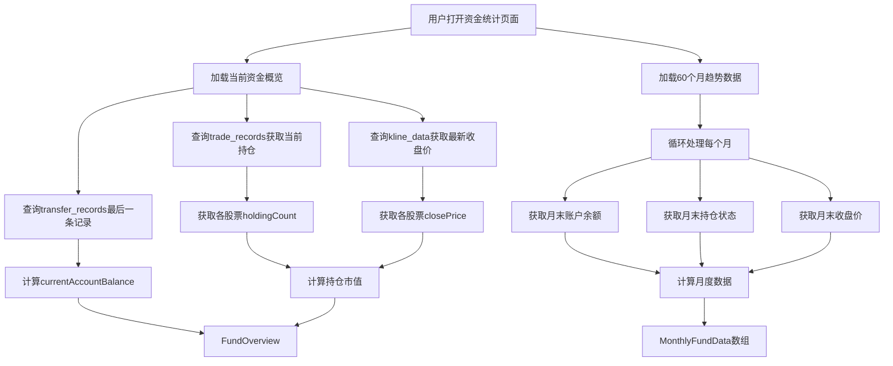

# Data Model: 资金统计标签页

**Date**: 2026-05-09  
**Feature**: 016-fund-statistics

## Overview

资金统计功能主要涉及从现有数据库表中读取数据并进行聚合计算，无需新增表结构。本章节定义关键数据实体和它们的关系。

## Existing Tables (Read-Only)

### transfer_records (已有表)

存储资金明细记录，包括账户余额。

| Column | Type | Description |
|--------|------|-------------|
| id | INTEGER PRIMARY KEY | 唯一标识符 |
| transferDate | TEXT (YYYY-MM-DD) | 转账日期 |
| amount | REAL | 金额（正数） |
| type | TEXT | 资金类型 (IN/OUT/DIVIDEND/DIVIDEND_TAX/STOCK_BUY/STOCK_SELL/INTEREST) |
| accountBalance | REAL | 账户余额（自动计算或手动设置） |
| createdAt | TEXT (ISO 8601) | 创建时间 |
| updatedAt | TEXT (ISO 8601) | 更新时间 |

**Indexes**:
- `idx_transfer_date` ON `transferDate` (用于按日期范围查询)

### trade_records (已有表)

存储股票交易记录，包含每条交易后的持仓数量。

| Column | Type | Description |
|--------|------|-------------|
| id | INTEGER PRIMARY KEY | 唯一标识符 |
| stockCode | TEXT | 股票代码 |
| stockName | TEXT | 股票名称 |
| tradeDate | TEXT (YYYY-MM-DD) | 交易日期 |
| tradeType | TEXT | 交易类型 (BUY/SELL/DIVIDEND) |
| tradePrice | REAL | 交易价格 |
| tradeCount | INTEGER | 交易数量 |
| holdingCount | INTEGER | **持仓数量**（该交易后的累计持仓） |
| holdingPrice | REAL | 持仓均价 |

**Indexes**:
- `idx_trade_stock_date` ON `(stockCode, tradeDate)` (用于查询某股票在指定日期前的最后一条记录)

### kline_data (已有表)

存储股票K线数据，包括每日收盘价。

| Column | Type | Description |
|--------|------|-------------|
| id | INTEGER PRIMARY KEY | 唯一标识符 |
| stockCode | TEXT | 股票代码 |
| date | TEXT (YYYY-MM-DD) | 交易日期 |
| openPrice | REAL | 开盘价 |
| closePrice | REAL | **收盘价**（用于计算持仓市值） |
| highPrice | REAL | 最高价 |
| lowPrice | REAL | 最低价 |
| volume | INTEGER | 成交量 |

**Indexes**:
- `idx_kline_stock_date` ON `(stockCode, date)` (用于查询某股票在指定日期的K线数据)

## Derived Entities (Computed)

### FundOverview (资金概览)

代表当前时刻的资金状况快照，通过查询现有表计算得出。

**Fields**:
- `currentAccountBalance`: number - 当前账户余额（来自transfer_records最后一条记录的account_balance）
- `currentHoldingsMarketValue`: number - 当前持仓市值（Σ(各持股最新收盘价 × holdingCount)）
- `totalAssets`: number - 总资产（currentAccountBalance + currentHoldingsMarketValue）

**Computation Logic**:
```typescript
// 伪代码
currentAccountBalance = SELECT accountBalance FROM transfer_records ORDER BY transferDate DESC LIMIT 1

holdings = SELECT DISTINCT stockCode, stockName, 
           (SELECT holdingCount FROM trade_records WHERE stockCode = t.stockCode ORDER BY tradeDate DESC LIMIT 1) as holdingCount
           FROM trade_records t
           WHERE holdingCount > 0

for each holding in holdings:
  closePrice = SELECT closePrice FROM kline_data 
               WHERE stockCode = holding.stockCode 
               ORDER BY date DESC LIMIT 1
  currentHoldingsMarketValue += closePrice * holding.holdingCount

totalAssets = currentAccountBalance + currentHoldingsMarketValue
```

### MonthlyFundData (月度资金数据)

代表某一个月的资金统计数据，按月聚合计算得出。

**Fields**:
- `month`: string (YYYY-MM) - 月份
- `endOfMonthAccountBalance`: number - 月末账户余额
- `endOfMonthHoldingsMarketValue`: number - 月末持仓市值
- `endOfMonthTotalAssets`: number - 月末总资产

**Computation Logic**:
```typescript
// 对于过去60个月的每个月
for month in past 60 months:
  monthEndDate = last day of month
  
  // 获取月末账户余额
  endOfMonthAccountBalance = SELECT accountBalance FROM transfer_records
                              WHERE transferDate <= monthEndDate
                              ORDER BY transferDate DESC LIMIT 1
  
  // 获取月末持仓状态
  holdings = SELECT stockCode, stockName, holdingCount
             FROM trade_records t1
             WHERE tradeDate <= monthEndDate
               AND tradeDate = (
                 SELECT MAX(t2.tradeDate) FROM trade_records t2
                 WHERE t2.stockCode = t1.stockCode AND t2.tradeDate <= monthEndDate
               )
             GROUP BY stockCode
  
  // 计算持仓市值
  endOfMonthHoldingsMarketValue = 0
  for each holding in holdings:
    closePrice = SELECT closePrice FROM kline_data
                 WHERE stockCode = holding.stockCode AND date <= monthEndDate
                 ORDER BY date DESC LIMIT 1
    endOfMonthHoldingsMarketValue += closePrice * holding.holdingCount
  
  endOfMonthTotalAssets = endOfMonthAccountBalance + endOfMonthHoldingsMarketValue
```

**Missing Data Handling**:
- 如果某月没有transfer_records记录，使用前值填充（上一个有数据的月份的accountBalance）
- 如果某月某股票没有kline_data，使用前值填充（该股票上一个有数据的交易日的closePrice）
- 如果完全没有持仓，则endOfMonthHoldingsMarketValue = 0

### PositionSnapshot (持仓快照)

代表某一时间点的持仓状态，用于中间计算。

**Fields**:
- `stockCode`: string - 股票代码
- `stockName`: string - 股票名称
- `holdingCount`: number - 持仓数量（直接从trade_records.holdingCount获取）
- `closePrice`: number - 该日期收盘价
- `marketValue`: number - 个股市值（closePrice × holdingCount）

### PieChartDataItem (饼图数据项)

用于饼图展示的数据结构。

**Fields**:
- `label`: string - 标签（"账户余额" 或 "持仓金额"）
- `value`: number - 数值（金额）
- `color`: string - 颜色（十六进制，如 #3b82f6）
- `percentage`: number - 百分比（占总资产的百分比，0-100）

**Computation**:
```typescript
percentage = (value / totalAssets) * 100
```

## Data Flow



## Validation Rules

### FundOverview
- `currentAccountBalance` >= 0 (理论上不应为负，但允许显示)
- `currentHoldingsMarketValue` >= 0
- `totalAssets` = `currentAccountBalance` + `currentHoldingsMarketValue`

### MonthlyFundData
- `month` 格式必须为 YYYY-MM
- `endOfMonthAccountBalance` >= 0 (允许使用前值填充)
- `endOfMonthHoldingsMarketValue` >= 0 (允许使用前值填充)
- 最多60个数据点

### PieChartDataItem
- `value` >= 0
- `percentage` >= 0 && `percentage` <= 100
- 所有扇区的percentage之和 = 100%（允许±0.01%的浮点误差）

## Performance Considerations

### Query Optimization
1. **索引使用**:
   - `transfer_records.transferDate` - 加速按日期范围查询
   - `trade_records(stockCode, tradeDate)` - 加速获取某股票最后一条记录
   - `kline_data(stockCode, date)` - 加速批量查询K线数据

2. **批量查询**:
   - 一次性获取60个月所需的所有kline_data，避免N+1查询
   - 使用 `IN` 子句批量查询多只股票的K线数据

3. **缓存策略**:
   - 前端store中缓存已加载的月度数据
   - 仅在页面首次加载时请求，不自动刷新

### Expected Query Performance
- 当前资金概览：< 500ms (3个简单查询)
- 60个月趋势数据：< 2s (取决于数据量，预计<1000条记录)
- 总体页面加载：< 3s (符合SC-001和SC-002)

## State Transitions

本功能不涉及状态转换，仅为数据展示功能。

## Relationships

```
transfer_records (1:N) → MonthlyFundData (聚合关系)
trade_records (1:N) → PositionSnapshot (筛选关系)
kline_data (1:N) → PositionSnapshot (关联关系)

FundOverview ← 由 transfer_records + trade_records + kline_data 计算得出
MonthlyFundData[] ← 由上述三表按月聚合计算得出
PieChartDataItem[] ← 由 FundOverview 转换得出
```
