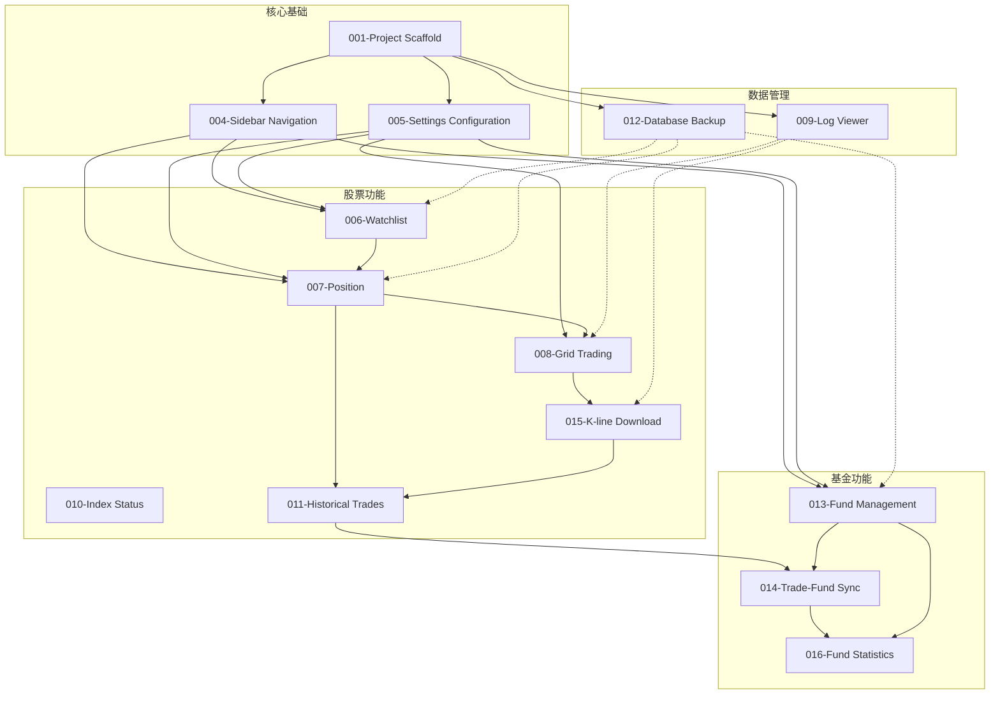

# StockAnalyzer 功能规范图谱

## 📊 Specs 目录结构分析

### 功能模块列表 (14个)

| ID | 功能模块 | 说明 |
|----|---------|------|
| 001 | Project Scaffold | 项目脚手架 - 基础架构搭建 |
| 004 | Sidebar Navigation | 侧边栏导航 - 应用导航系统 |
| 005 | Settings Configuration | 设置配置 - 用户偏好和系统配置 |
| 006 | Stock Watchlist Page | 股票自选页面 - 监控股票列表 |
| 007 | Position Page | 持仓页面 - 当前持仓管理 |
| 008 | Grid Trading | 网格交易 - 自动化交易策略 |
| 009 | Add Log Viewer | 日志查看器 - 系统日志展示 |
| 010 | Index Status Bar | 指数状态栏 - 市场指数显示 |
| 011 | Historical Trades | 历史交易 - 交易记录管理 |
| 012 | Database Backup | 数据库备份 - 数据安全保障 |
| 013 | Fund Management | 基金管理 - 基金投资管理 |
| 014 | Trade-Fund Sync | 交易-基金同步 - 数据一致性 |
| 015 | K-line Download | K线下载 - 历史行情数据 |
| 016 | Fund Statistics | 基金统计 - 投资数据分析 |

---

## 🔗 功能依赖关系图



---

## 📈 功能分类统计

### 按业务领域

| 类别 | 数量 | 功能模块 |
|------|------|---------|
| **基础设施** | 3 | 001, 004, 005 |
| **股票交易** | 6 | 006, 007, 008, 010, 011, 015 |
| **基金管理** | 3 | 013, 014, 016 |
| **系统工具** | 2 | 009, 012 |

### 按实现复杂度

| 复杂度 | 数量 | 特征 |
|--------|------|------|
| **高** | 4 | 008网格交易, 013基金管理, 015K线下载, 016基金统计 |
| **中** | 6 | 006自选, 007持仓, 010指数, 011历史交易, 014同步, 012备份 |
| **低** | 4 | 001脚手架, 004导航, 005设置, 009日志 |

---

## 🎯 核心功能链路

### 股票交易流程
```
Watchlist(006) → Position(007) → Grid Trading(008) → Historical Trades(011)
                      ↓                    ↓
                 K-line Download(015) ←──┘
```

### 基金管理流程
```
Fund Management(013) → Trade-Fund Sync(014) → Fund Statistics(016)
```

### 数据保障链路
```
Database Backup(012) ← 所有功能模块
Log Viewer(009) ← Grid Trading, K-line Download
```

---

## 💡 架构洞察

### 1. 双核心业务
- **股票交易**: 6个功能模块,覆盖从监听到交易的全流程
- **基金管理**: 3个功能模块,形成完整的投资管理闭环

### 2. 共享基础设施
- 所有功能都依赖 `001-Project Scaffold` (项目基础)
- 导航(`004`)和配置(`005`)被所有页面级功能复用
- 数据备份(`012`)保护所有业务数据

### 3. 功能演进顺序
```
Phase 1: 基础建设 (001, 004, 005)
Phase 2: 核心业务 (006, 007, 013)
Phase 3: 高级功能 (008, 010, 011, 015, 016)
Phase 4: 系统集成 (009, 012, 014)
```

### 4. 数据流向
- **输入**: Watchlist, Fund Management (用户主动添加)
- **处理**: Grid Trading, Trade-Fund Sync (自动化)
- **输出**: Position, Historical Trades, Fund Statistics (结果展示)
- **支撑**: Database Backup, Log Viewer (系统保障)

---

## 🔍 与代码实现的对应关系

基于之前的 graphify 分析,specs 文档与代码的映射:

| Spec | 主要代码文件 | 社区标签 |
|------|-------------|---------|
| 006-Watchlist | `src/views/WatchlistView.vue`, `electron/database.ts` | Vue Components + Electron Services |
| 007-Position | `src/views/PositionView.vue`, `electron/services/fundService.ts` | View Pages + Electron Services |
| 008-Grid Trading | `electron/services/gridService.ts` | Electron Services |
| 013-Fund Management | `electron/services/fundService.ts`, `src/stores/fundStore.ts` | Electron Services + Pinia Stores |
| 015-K-line Download | `electron/services/klineDownloadService.ts` | Electron Services |
| 016-Fund Statistics | `src/components/FundStatistics.vue` | Vue Components |

---

## 📝 总结

**Specs 目录的价值**:
- ✅ 14个功能模块的完整规范
- ✅ 清晰的功能依赖关系
- ✅ 分阶段的实施计划
- ✅ 与代码实现的良好对应

**如何进一步探索**:
1. 阅读具体 spec.md 了解详细需求
2. 查看对应的 plan.md 了解实现方案
3. 参考 tasks.md 了解具体任务分解
4. 使用 `/speckit-analyze` 检查规范一致性

---

*生成时间: 2026-05-14*  
*分析方法: 手动结构化分析 + graphify 代码关联*
